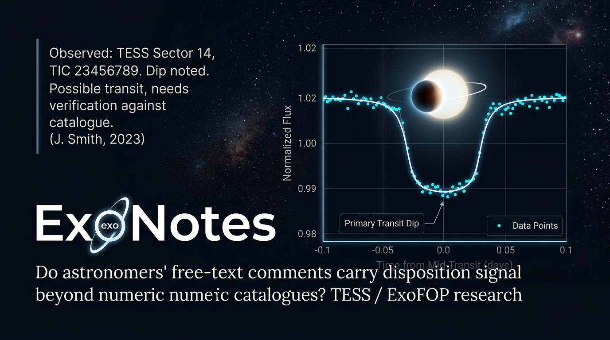

# ExoNotes

<p align="center">
  
</p>

<p align="center">
  <a href="https://github.com/KevinArce/ExoNotes/actions/workflows/reproduce.yml">
    
  </a>
</p>

**Do the free-text notes astronomers write on TESS Objects of Interest carry
disposition-relevant information that the numeric catalogue columns do not?**

That is the whole question. It is falsifiable, it is cheap to test, and **a null result is a
valid and useful outcome** — so this repository is built to report one honestly if that is what
the data says.

**Method.** Convert ExoFOP observer notes into numeric semantic features with a System One model
(Jev, TypeSafe AI), then measure whether those features improve held-out prediction of TFOPWG
disposition over a numeric-only baseline. (The study began on the `Comments` field and moved off
it — that field restates the label in nearly half its rows; see below.) The model is the **featurizer**, gradient boosting is
the **predictor**, grouped cross-validation by host star is the **arbiter**. The model's own
probabilities are never thresholded into a decision — its calibration degrades ~4.4× out of
distribution, and astrophysics is maximally out of distribution for it.

---

## Status — answered, and all six gates pass

**[`RESULTS.md`](./RESULTS.md) is the write-up. The short version:**

> **ΔAUC(D − B) = +0.0440, 95% CI [+0.0332, +0.0554]** — model D (numeric covariates + semantic
> features) over baseline B (numeric only), under grouped cross-validation by host star,
> `TIER_PREDICTIVE` questions only, paired bootstrap over TIC groups.
> **5.4× the minimum effect the study was pre-registered to detect (+0.0082).**

| | |
| :--- | :--- |
| ✅ Corpus | **1,482 labelled TOIs across 1,388 host stars**, 53.8% positive — ExoFOP observer notes (`Groupname IS NULL`), not the TFOP working-group `Comments` field |
| ✅ G1 pipeline sanity | Numeric baseline **0.9051** AUC vs 0.4840 prior |
| ✅ G2 headline · G3 stability · G4 temporal · G5 leakage-stripped · G6 missingness | **All pass.** [Every interval](./RESULTS.md#2-every-gate-with-its-interval) |
| ⚠️ The pre-registered prior | **Falsified.** A null was predicted in advance and did not happen — [why](./RESULTS.md#5-the-pre-registered-prior-was-wrong) |
| 💸 Spend to date | **~$0.3201** |

**The caveats travel with the number.** A cold-cache re-run lands *near* +0.0440, not on it; one
registered split component (S2b) was not applied; two label-echo features fail the stability
gate. All of it is in [`RESULTS.md`](./RESULTS.md), not buried.

## Two findings that are already useful

Both are things anyone pointing a language model at archive text will hit, so they are stated
here rather than buried in the log.

### 1. Nearly half the ExoFOP `Comments` corpus restates the label

**This is why the study moved to observer notes.** Measured over 2,725 labelled rows of the
`Comments` field — the corpus this project started on and then abandoned:

| Marker in comment text | n | P(confirmed planet \| marker) |
| :--- | ---: | ---: |
| bare planet designation (`WASP-68 b`, `Kepler-718 b`) | 679 | **0.999** |
| contains `retir*` ("retired as NEB") | 488 | **0.006** |
| contains `TFOP FP` | 502 | **0.000** |
| **any of the above** | **1,304 (47.9%)** | — |

A planet has a name only because it was confirmed, so a comment reading `WASP-68 b` **is** the
label written in prose. A TF-IDF baseline on this text scores **0.969 AUC** — and its strongest
positive terms are survey prefixes (`wasp, k2, kepler, hat, kelt, ngts`). **That number is
leakage, not signal, and must never be cited as evidence for the hypothesis.**

There is also **no timestamp on the `Comments` field** — not in ExoFOP, not in the NASA
Exoplanet Archive, and no revision log in any `etta` endpoint — so post-hoc edits cannot be
filtered out. ([`PLAN.md`](./PLAN.md) §2.)

### 2. `pscomppars` cannot be used as a covariate source

The NASA Exoplanet Archive's `pscomppars` table contains **confirmed planets only**. Membership
in it predicts the label at **P=0.995 vs 0.074** — so a model built on it leaks the label through
*missingness alone*, scores ~0.99 AUC, and contains no astrophysics. An earlier version of this
plan specified it as the covariate source; that was wrong. Covariates come from the `toi` table.
([`PLAN.md`](./PLAN.md) §3.2.)

---

## Repository guide

| File | What it is |
| :--- | :--- |
| **[RESULTS.md](./RESULTS.md)** | **The answer**, with reliability diagrams, every confidence interval, the falsified prior, and what was not done. |
| **[PREREGISTRATION.md](./PREREGISTRATION.md)** | The criteria, fixed before the run. §11 is the append-only amendment log; §11.5 is the only section written after the result. |
| **[PLAN.md](./PLAN.md)** | The build plan, the guardrails, and the pre-registered gates. §0.5 is the work-logging protocol; §2 is the validity threat; §11 covers public release. |
| **[WORKLOG.md](./WORKLOG.md)** | Append-only record of every step, including every failure and every place the plan turned out to be wrong. **The most honest file here.** |
| **[PROVENANCE.md](./PROVENANCE.md)** | SHA256 of each raw source. `data/` is not committed. |
| [HANDOFF_PROMPT.md](./HANDOFF_PROMPT.md) | Pasteable prompt for the next working session. |
| [CONTRIBUTING.md](./CONTRIBUTING.md) | How to reproduce, and the two rules that keep this auditable. |
| [research/03_*](./research/03_jev_astrophysics_evidence_based_assessment.md) | Why this project, and why it is deliberately **not** a transit vetter. |
| [research/04_*](./research/04_first_live_measurements.md) | First live model calls. Found 3 of 7 draft questions defective. |

⚠️ `research/01_*` and `research/02_*` are **superseded** where they conflict with `03_*`, which
itemizes ten corrections in §1.4. They are kept because the correction history is part of the
record — not because they are reliable.

**What is measured vs. what is sourced:** `research/01–03` are sourced to vendor documentation
and third-party evaluation and contain **no measurement of our own**. Only
[`research/04`](./research/04_first_live_measurements.md) and [`WORKLOG.md`](./WORKLOG.md) report
our own calls.

## Reproducing

```bash
uv venv --python 3.14 .venv
uv pip install -r requirements.txt
.venv/bin/python scripts/01_ingest.py             # ~25 s
.venv/bin/python scripts/02_baselines.py          # ~2 min, reproduces gate G1
.venv/bin/python scripts/029_verify_reproduction.py   # asserts G1 actually reproduced
.venv/bin/python scripts/026_noise_floor.py       # ~2 min, gate G2's noise floor and MDE
```

No API key required — none of these steps makes a model API call.
See [CONTRIBUTING.md](./CONTRIBUTING.md).

### Reproducing the headline result (needs an API key, ~$0.24)

```bash
.venv/bin/python scripts/028_obsnotes_pull.py         # ~6 min, $0 — the corpus
.venv/bin/python scripts/034_step3_features.py        # ~7 min, ~$0.24 cold / $0.00 warm
.venv/bin/python scripts/035_gates_g2_g6.py           # ~15 min, $0 — G2, G4, G5, G6
.venv/bin/python scripts/036_gate_g3_stability.py     # ~2 min, ~$0.06 — G3
.venv/bin/python scripts/037_reliability.py           # ~1 min, $0 — the RESULTS.md figures
```

> **⚠️ A cold-cache re-run lands near the published number, not exactly on it.** `jev-1.13.0`
> is effectively deterministic within a session (mean |Δ| **0.0001** between calls minutes
> apart) but drifts slightly over longer gaps (**0.0049** at ~1 hour), measured on
> byte-identical requests. `data/` is gitignored, so the 1,382 cached responses are not in this
> repository: from that cache the pipeline is exact, without it only approximate. No gate
> verdict is at risk — the closest confidence interval to zero is G5's +0.0272. Details:
> [`PROVENANCE.md`](./PROVENANCE.md) and `PREREGISTRATION.md` §11.5 (A-31).

**This is checked automatically.** The badge above runs the same three commands on a clean
clone, on a fresh GitHub runner, weekly and on every change to `scripts/`, `src/` or
`requirements.txt`. It asserts that baseline B still beats the prior by a wide margin.

It does **not** assert the numbers match exactly, and it should not: ExoFOP updates
continuously and the NASA Exoplanet Archive syncs weekly, so a later pull genuinely differs.
What must survive is the finding, not the bytes — the committed checksums in
[PROVENANCE.md](./PROVENANCE.md) are what pin the exact snapshot.

If ExoFOP is throttling or down, the run fails with a message saying so explicitly, so an
upstream outage is never mistaken for a broken repository.

## Acknowledgements

> This research has made use of the **Exoplanet Follow-up Observation Program (ExoFOP)** website,
> which is operated by the California Institute of Technology under contract with the National
> Aeronautics and Space Administration under the Exoplanet Exploration Program.
>
> This research has made use of the **NASA Exoplanet Archive**, which is operated by the
> California Institute of Technology under contract with the National Aeronautics and Space
> Administration under the Exoplanet Exploration Program.

TOI table access uses [`etta`](https://pypi.org/project/etta/) (MIT).

## Licence

Code is **MIT** ([LICENSE](./LICENSE)). Prose and figures are **CC BY 4.0**. No archival data is
redistributed here.
