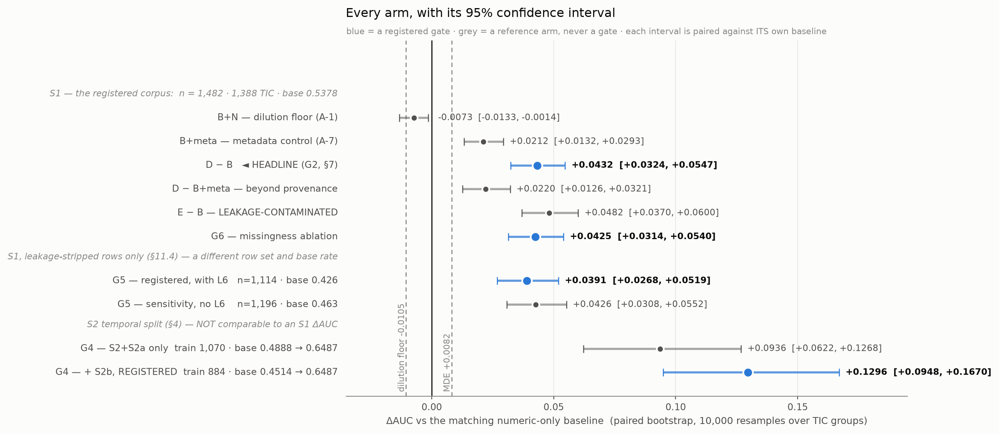
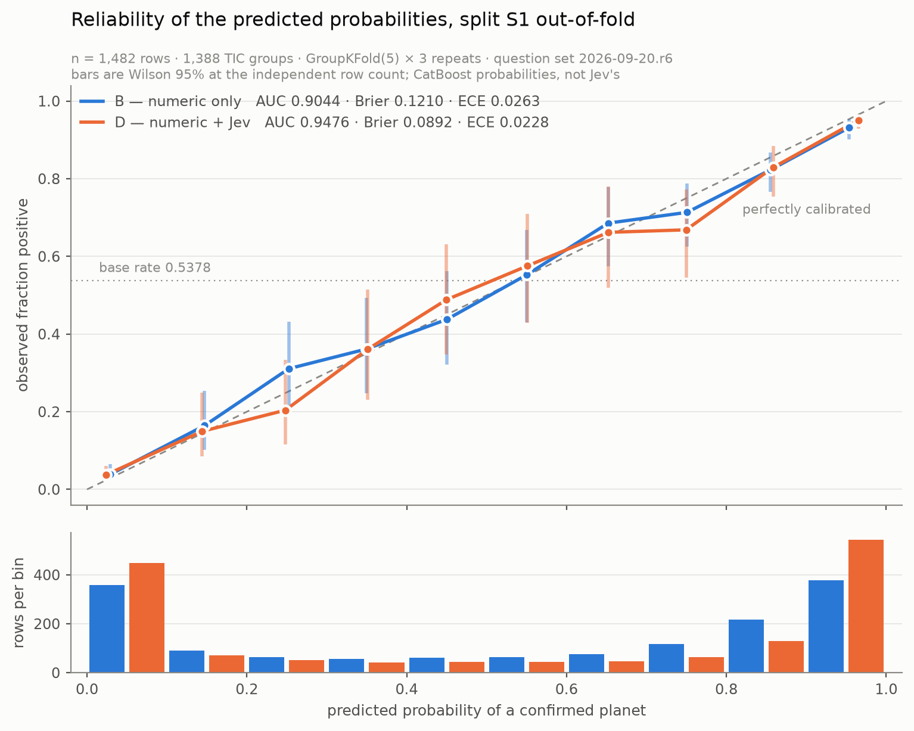

# ExoNotes — Results

**Do the free-text notes astronomers write on TESS Objects of Interest carry
disposition-relevant information that the numeric catalogue columns do not?**

**Yes, on this corpus, by a margin 5.3× the effect this study was powered to detect.**

This document is [`PREREGISTRATION.md`](./PREREGISTRATION.md) §9 item 7. Every criterion it
reports against was committed and pushed (`4198379`) **before** the first full-corpus model call
was made. Nothing below revises a criterion; where the study was wrong in advance — and it was,
on the central prediction — that is reported in [§5](#5-the-pre-registered-prior-was-wrong) rather
than dropped.

---

## 1. The headline

§7 defines the headline as **one number**: ΔAUC of model **D − B** under split **S1**, using
**`TIER_PREDICTIVE` questions only**, with its bootstrap 95% CI.

> ### ΔAUC(D − B) = **+0.0432**, 95% CI **[+0.0324, +0.0547]**
>
> n = 1,482 rows · 1,388 TIC groups · base rate 0.5378 · GroupKFold(5) × 3 repeats ·
> paired bootstrap, 10,000 resamples over TIC groups.
> **B = 0.9044 → D = 0.9476.**

§7 requires four things be reported beside it, always, never instead of it:

| companion | value | what it means |
| :--- | :--- | :--- |
| **E − B**, the full-question-set gain | **+0.0482** [+0.0370, +0.0600] | **Leakage-contaminated.** E adds the three `TIER_LABEL_ECHO` questions, which may restate the disposition. It is an upper bound, never the headline. |
| **Baseline C**, TF-IDF on raw text | **AUC 0.8766** | **Labelled as leakage by construction.** On the earlier `Comments` corpus C scored 0.9691 and its strongest terms were catalogue prefixes — pure label echo. Here it lands **below** B. See [§4](#4-why-this-is-not-a-leakage-signature). |
| **The G5 arm**, leakage-stripped | **+0.0391** [+0.0268, +0.0519] | n = 1,114 · base 0.4264. Stripping removes more positives than negatives, so **a G5 AUC is not comparable to a G2 AUC.** |
| **The S2 result**, with its base-rate shift | **+0.1296** [+0.0948, +0.1670] | The registered split, S2 + S2a + S2b: train 884 / test 390. **Train base 0.4514 → test base 0.6487.** The shift is expected and is the point; **an S2 AUC is not an S1 AUC** and is not quoted as one. Without S2b it is +0.0936 — see [§6a](#6a-the-temporal-split-g4-and-s2b). |

**Against the registered detection bar.** [`PREREGISTRATION.md`](./PREREGISTRATION.md) §11.3
A-20 fixed, before the run, a minimum detectable effect of **+0.0082** at 80% power, and a
dilution floor of **−0.0105** — the AUC cost of adding seven *known-worthless* columns to this
CatBoost. The headline is **5.3× the MDE**, and its CI lower bound of +0.0324 clears the
dilution floor by a wide margin.

---

## 2. Every gate, with its interval

All six gates pass.

| gate | criterion, as registered in §6 | result | verdict |
| :--- | :--- | :--- | :--- |
| **G1** | B ≥ 0.85 AUC and B > A by a bootstrap 95% CI excluding zero | B **0.9051** vs A 0.4840 · Δ +0.4212 [+0.3977, +0.4441] | ✅ **PASS** |
| **G2** | D beats B on ΔAUC under S1, CI excluding zero | **+0.0432** [+0.0324, +0.0547] | ✅ **PASS** |
| **G3** | Spearman ρ ≥ 0.85 **and** mean \|Δp\| ≤ 0.05 per feature, under paraphrase | **7/7 `TIER_PREDICTIVE`** clear both halves | ✅ **PASS** |
| **G4** | the gain survives on `TIER_PREDICTIVE` only, under S2 | **+0.1296** [+0.0948, +0.1670] | ✅ **PASS** |
| **G5** | the gain survives on the leakage-stripped arm | **+0.0391** [+0.0268, +0.0519] | ✅ **PASS** |
| **G6** | the gain survives an explicit-missingness ablation | **+0.0425** [+0.0314, +0.0540] | ✅ **PASS** |



The reference arms are on the same figure because they are what make the gates readable:

- **B+N, the dilution floor (A-1):** **−0.0073** [−0.0133, −0.0014]. Seven pure-Gaussian columns
  *cost* AUC. A reported ΔAUC of 0.000 would therefore not be a null — it would be real signal
  cancelling dilution. This arm is why.
- **B+meta, the metadata control (A-7):** **+0.0212** [+0.0132, +0.0293]. Note count, total
  characters and an author one-hot — **no model call at all** — reach 0.9256. Provenance alone
  does add signal.
- **D − B+meta:** **+0.0220** [+0.0126, +0.0321]. The prose adds **beyond** provenance. This is
  the single most important control in the study; see [§4](#4-why-this-is-not-a-leakage-signature).

### Two values of B appear in this repository, and here is why

[`scripts/030_gate_g1_obsnotes.py`](scripts/030_gate_g1_obsnotes.py) reports **B = 0.9051**;
[`scripts/035_gates_g2_g6.py`](scripts/035_gates_g2_g6.py) reports **B = 0.9044**, on the same
1,482 rows, the same folds, the same seed and the same CatBoost configuration. The only
difference is the order the rows are read in — 035 adds `order by a.toi` for the feature join.
[`scripts/037_reliability.py`](scripts/037_reliability.py) fits both orderings and reproduces
both numbers exactly: **CatBoost is sensitive to input row order, worth 0.0008 AUC here.**

That is ~10× below the MDE and moves no verdict. Every ΔAUC in this document is computed
against the B fitted on **its own** arm's row ordering and row set, so the pairing is never
broken; 0.9051 is G1's B and 0.9044 is G2's.

---

## 3. Reliability, and where the gain actually comes from



These calibrate **CatBoost's** `predict_proba`, not the model's own confidence.
[`PLAN.md`](./PLAN.md) §1 forbids thresholding on Jev's `confidence` — that guardrail is about a
distribution-shape statistic and is untouched here. No model probability is thresholded anywhere
in this study; they enter only as features.

| | B — numeric only | D — numeric + Jev |
| :--- | ---: | ---: |
| AUC | 0.9044 | **0.9476** |
| **Brier** (mean over 3 S1 repeats) | 0.1210 [0.1195–0.1231] | **0.0892** [0.0869–0.0905] |
| **ECE**, 10 equal-width bins | 0.0263 [0.0240–0.0295] | 0.0228 [0.0217–0.0237] |
| **MCE** | 0.0835 | **0.1196** |
| rows placed in the two extreme bins | 737 (49.7%) | **992 (67.0%)** |

**The gain is sharpness, not calibration — and that distinction matters.** Brier falls 26%,
but ECE barely moves. D is **not** meaningfully better calibrated than B; it is more
*decisive*. It moves 255 more rows into p < 0.1 or p > 0.9, and it is right about them.

**D's worst bin is meaningfully worse than B's.** MCE rises from 0.0835 to **0.1196**. On the
pooled curve the offending bin is 0.7–0.8 — 63 rows, predicted 0.750, observed **0.668**, a gap
of 0.081. D is sharper overall *and* less reliable in its upper-middle band, which is exactly
the trade a sharper model makes. Reported rather than rounded away.

**On the three S1 repeats.** Each row gets one out-of-fold prediction per repeat, so the three
vectors are correlated, not independent replicates. Brier, ECE and MCE are therefore computed
per repeat and reported as mean [min–max]. The plotted curve pools all three, but its per-bin
Wilson 95% intervals are computed at **n_eff = count / 3** — the independent row count — rather
than at the pooled count, which would claim three times the precision the data has.

---

## 4. Why this is not a leakage signature

This is the failure mode the whole study is built around. Nearly half the earlier `Comments`
corpus restated the label in prose, and a TF-IDF baseline on it scored 0.9691 AUC of pure echo.
Three independent checks, **each registered in advance**, say this result is not that.

**1. It survives the metadata control.** The named worry (A-23) was that the signal is really
*which follow-up group bothered to write a note*. B+meta reaches 0.9256 — metadata alone adds
+0.0212, so the worry was well-founded — and **D still beats B+meta by +0.0220, CI
[+0.0126, +0.0321]**.

**2. It survives leakage stripping, and the verdict does not flip between arms.** §11.4's
clause set strips **368 of 1,482 rows (24.8%) at P(y=1) = 0.875**:

| clause | what it strips | n | P(y=1) |
| :--- | :--- | ---: | ---: |
| `L6` archive provenance | `ExoFOP-Kepler`, `ExoFOP-K2`, `KOI…`, `EPIC…` | 231 | **0.948** |
| `L7` structured disposition field | the Kepler/K2 `Possible planetary candidate = Yes` extracts | 136 | 0.941 |
| `L3` confirmed / validated / published | | 101 | 0.891 |
| `L8` DACE `Status:` line | | 97 | 0.866 |
| `L1` retired | | 17 | 0.235 |
| `L9` disposition transition | | 11 | 0.364 |
| `L2`, `L4b`, `L5` | **fire on 0 rows** | 0 | — |
| `L4a` catalogue designation | | 1 | 1.000 |

`L6` is the contested one: it is *provenance*, not a disposition statement, and A-25 committed
in advance to reporting both arms either way. **With L6: +0.0391. Without L6: +0.0426. The
verdict does not flip.**

**`L5` is a tripwire and it did not fire.** §5.1 registered that if `Master Disp:` /
`Phot Disp:` / `Spec Disp:` appeared on any row, the corpus filter had failed and Step 3 must
stop — a pipeline bug, not a finding. It fired on **0 of 1,482 rows**. The
`Groupname IS NULL` filter removes the disposition channel completely.

**3. Baseline C is *below* B.** C scores **0.8766** against B's 0.9044. On `Comments` the same
baseline scored 0.9691 and was pure echo. Here, **raw text alone is weaker than the numeric
columns** — there is no readable label lying in the prose — yet structured judgments over that
same text add +0.0432. **Whatever D is using, TF-IDF cannot find it.** That is the opposite of
a leakage signature.

### What this does **not** establish

That the gain is *astrophysically* meaningful. That it generalises beyond TESS/ExoFOP observer
notes. That these features would help a vetter that already ingests pixels and flux — they are
not tested against one, and [`research/03_*`](./research/03_jev_astrophysics_evidence_based_assessment.md)
§2.2 is explicit that this project is deliberately **not** a transit vetter. The headline is one
number on one corpus.

---

## 5. The pre-registered prior was wrong

**This study predicted, in public and in advance, that it would find nothing.** A-23 registered
that no content probe cleared 0.68 univariate AUC by regex, and that **a null was the expected
outcome**. A-20 had fixed the bar a feature must clear at ≈ 0.68.

**Four of the seven predictive features clear it.**

| feature | regex proxy \|AUC\| (A-23, before) | **measured \|AUC\|** | gain |
| :--- | ---: | ---: | ---: |
| `spectroscopy_indicates_nonplanetary_companion` | 0.586 | **0.749** | **+0.163** |
| `spectroscopy_consistent_with_planet` | 0.509 | **0.705** | **+0.196** |
| `host_star_described_as_evolved` | 0.590 | **0.695** | +0.105 |
| `imaging_reports_no_companion` | 0.643 | **0.683** | +0.040 |
| `followup_reported_concluded` | 0.613 | 0.648 | +0.035 |
| `imaging_reports_companion_present` | 0.528 | 0.636 | +0.108 |
| `author_certainty` | — | 0.579 | — |

**The error was in the estimator, not in the reasoning.** A-23 bounded the achievable signal
with regex proxies and explicitly flagged that a regex is a loose proxy for a judgment. That
caveat was correct and larger than allowed for: **the semantic judgment beats the token proxy by
0.10–0.20 AUC on the two spectroscopic questions.** A note saying the companion is consistent
with a planetary mass and a note saying it is not share almost all of their vocabulary; the
distinction is in the claim, not the words.

A falsified prior is a good outcome for a pre-registration, not an embarrassing one — it is the
only thing that distinguishes a registered study from a story told after the fact. It stays in
the write-up.

---

## 6. Stability under paraphrase (G3)

200 rows, fixed seed, every question re-worded and re-asked. Registered criterion: **Spearman
ρ ≥ 0.85 per feature and mean |Δp| ≤ 0.05.**

| feature | tier | ρ | mean \|Δp\| | IQR | verdict |
| :--- | :--- | ---: | ---: | ---: | :--- |
| `imaging_reports_no_companion` | predictive | 0.884 | 0.0456 | 0.475 | ✅ |
| `imaging_reports_companion_present` | predictive | 0.888 | 0.0158 | 0.030 | ✅ |
| `spectroscopy_indicates_nonplanetary_companion` | predictive | 0.949 | 0.0196 | 0.093 | ✅ |
| `spectroscopy_consistent_with_planet` | predictive | 0.948 | 0.0309 | 0.200 | ✅ |
| `host_star_described_as_evolved` | predictive | 0.964 | 0.0130 | 0.100 | ✅ |
| `followup_reported_concluded` | predictive | 0.960 | 0.0128 | 0.940 | ✅ |
| `author_certainty` | predictive | 0.992 | 0.0135 | 0.268 | ✅ |
| `indicates_retired_or_rejected` | label-echo | **0.812** | 0.0096 | 0.010 | ❌ **fails ρ** |
| `indicates_confirmed_planet` | label-echo | 0.939 | 0.0189 | 0.050 | ✅ |
| `contains_object_designation` | label-echo | **0.814** | **0.0626** | 0.010 | ❌ **fails both** |

**G3 passes because §7 puts only `TIER_PREDICTIVE` in the headline, and all seven clear both
halves.** But two features do fail, and they are reported as failures:

- `contains_object_designation` fails **both** halves. It is the near-constant column (mean
  0.929 across the corpus), so this is genuine instability, not a tie artefact.
- `indicates_retired_or_rejected` fails ρ only; its mean |Δp| of 0.0096 is five times inside
  the bar.
- **Both have IQR exactly 0.010**, so A-8 item 11's exemption — *"inter-quartile range below one
  quantisation step (0.01)"* — misses on a strict reading of *below*. **Relaxing `<` to `<=`
  after seeing these numbers would convert both failures into passes. That change was not
  made.**

**The paraphrase effect is measured against a noise floor, not against an assumed zero.** A
same-wording repeat arm was added when the model turned out not to be bit-stable over time
([§8](#8-the-limit-on-reproducing-this)). Mean |Δp| under paraphrase is **0.0242**; under an
identical re-ask minutes later it is **0.0001**. The paraphrase effect is **412× the
within-session noise**, so G3 measures wording sensitivity rather than jitter.

**G3(b) is vacuous and that is registered rather than skipped.** §6 asks for a permuted state
key order; A-4 reduced the state to the single key `notes`, so there is nothing to permute.
[`scripts/036_gate_g3_stability.py`](scripts/036_gate_g3_stability.py) asserts the state has
exactly one key, so the test stops being vacuous automatically if an amendment ever adds one.

---

## 6a. The temporal split (G4), and S2b

§4 registers the temporal split in three parts. The first two — the 2021-10-28 cutoff on
`date_toi_alerted` (**S2**) and dropping from *test* any row whose TIC also appears in train
(**S2a**) — were applied when the gates first ran. The third was not:

> **S2b** — for the S2 **training** side only, include a note **iff its `Lastmod` < the
> cutoff.** This approximates the text as it stood when the candidate was young, which the
> `Comments` field made impossible.

**S2b has now been applied**, and G4 below is the registered split rather than an approximation
to it. 2,865 of 3,963 observer notes (72.3%) survive the cutoff. `Lastmod` is non-null on all
6,855 notes, so §4's undated-note case does not arise here.

| arm | train | B | D | ΔAUC | 95% CI | |
| :--- | ---: | ---: | ---: | ---: | :--- | :--- |
| G4 — S2 + S2a, without S2b | 1,070 | 0.8209 | 0.9146 | +0.0936 | [+0.0622, +0.1268] | |
| **G4 — S2 + S2a + S2b, registered** | 884 | 0.8039 | **0.9334** | **+0.1296** | **[+0.0948, +0.1670]** | ✅ **PASS** |
| G4c — same 884 rows, unfiltered text | 884 | 0.8039 | 0.9089 | +0.1050 | [+0.0732, +0.1400] | *not a gate* |

The test side is the same 390 rows throughout, base rate 0.6487. Train base moves 0.4888 →
0.4514.

**Why 186 training rows disappear.** §1.1 defines the corpus as rows with at least one observer
note of non-zero length. Under S2b, 186 training rows lose *all* their text and no longer
qualify, so training goes 1,070 → 884. **B and D both train on those same 884 rows** — if B
kept all 1,070 while D lost 186, ΔAUC would conflate the text filter with a sample-size change.
The G4c row exists to price that confound, and the two effects separate cleanly:

- **Dropping the 186 rows** (G4 → G4c): B falls 0.8209 → 0.8039 (**−0.0170**), D falls 0.9146 →
  0.9089 (**−0.0057**). ΔAUC rises **because the numeric baseline suffers more from the smaller
  training set than the text-enriched model does** — not because D improved.
- **The text filter itself** (G4c → G4): B is *identical*, so the entire move is D, 0.9089 →
  **0.9334**.

**That second step was tested directly**, because the two intervals overlap and +0.0246 cannot
be read off them. A paired bootstrap on the same 390 test rows — B being identical in both arms,
so the difference in ΔAUC *is* D(S2b text) − D(full text) — gives **+0.0246, 95% CI
[+0.0115, +0.0383]**.

**It is still not a gate.** No section registered this comparison in advance; it is a post-hoc
result on 390 test rows and is labelled as one.

### S2 is one fit where S1 is fifteen, and that matters more than it looks

The paired bootstrap resamples **test groups**. It does not resample the model fit. Under S1 the
registered aggregation averages 5 folds × 3 repeats, so fit variance is largely averaged out.
**Under S2 there is exactly one train/test split and one CatBoost fit per arm**, so the point
estimate carries fit noise the interval does not show. Measured over 10 CatBoost seeds:

| arm | mean ΔAUC | sd | range over seeds |
| :--- | ---: | ---: | :--- |
| G4 — S2 + S2a | +0.0954 | 0.0044 | [+0.0887, +0.1034] |
| **G4 — + S2b** | **+0.1286** | 0.0047 | [+0.1210, +0.1342] |
| G4c — 884 rows, full text | +0.1091 | 0.0050 | [+0.1045, +0.1179] |

**An S2 ΔAUC is worth about ±0.005 of seed noise — roughly five times the S1 figure.** Any
S2 number in this document should be read with that in mind, and comparisons between S2 arms
that are closer together than ~0.01 should not be trusted on the point estimate alone.

**The S2b effect does survive that test:** G4's worst seed (+0.1210) still sits above G4c's
best (+0.1179), so the separation is not a seed artefact. That is the strongest honest form of
the claim — **training D on time-filtered text does not degrade it, and on this split appears
to help** — on a comparison that was not registered.

**What S2b does not control.** `Lastmod` is last-modified, not created, so a 2019 note edited in
2023 is dropped by a 2021 cutoff. §4 says this plainly and it stands: **S2b tests on *less*
text, not on *older* text.** Dropping is the safe direction — it removes text that may carry
post-hoc knowledge — but it is not a reconstruction of what the note said in 2021.

---

## 7. What was measured, on what

| | |
| :--- | :--- |
| **Corpus** | ExoFOP `download_obsnotes`, **observer notes only** (`Groupname IS NULL` — this filter is the entire reason for the corpus; it removes TFOP working-group notes, which state the disposition outright) |
| **Rows** | **1,482** TOIs · **1,388** unique TIC · base rate **0.5378** · median 870 characters |
| **Coverage** | 54.5% of the labelled analysis set. 6,855 notes across 2,573 TIC were pulled; ~⅓ of TICs have no observer note at all and are excluded |
| **Label** | TFOPWG disposition: CP/KP = 1, FP/FA = 0. PC/APC excluded |
| **Questions** | [`src/exonotes/questions.py`](src/exonotes/questions.py) `2026-09-20.r6` — **7 `TIER_PREDICTIVE` + 3 `TIER_LABEL_ECHO`**, frozen before the run; gate score 219/221 assertions on 27 label-blinded real notes |
| **Model** | `jev-1.13.0`, **pinned and asserted on every response**; one request per row, many questions per request |
| **Predictor** | CatBoost (500 iterations, depth 4, lr 0.05), identical configuration in every arm |
| **Spend** | Step 3: 1,462 calls · 5,763,547 input tokens · **$0.2421**. S2b: 203 calls · **$0.0338**. **Whole study: ~$0.3539**, plus **~$0.32** for the first CI gate run ([§8a](#8a-the-cold-cache-reproduction-measured)) |

The division of labour is the point: **the language model is the featurizer, gradient boosting
is the predictor, grouped cross-validation by host star is the arbiter.** A model judgment is a
feature, never a conclusion.

---

## 8. The limit on reproducing this

**A clean clone re-running the pipeline from a cold cache will land near +0.0432, not on it.**
**This is no longer a prediction — it has been measured.** See
[§8a](#8a-the-cold-cache-reproduction-measured) below.

`jev-1.13.0` is effectively deterministic *within* a session but drifts slightly over time. Two
byte-identical requests — same pinned model, same state, same questions, verified by a shared
content-addressed cache key — returned:

| gap between the two calls | mean \|Δ\| per feature | Spearman ρ |
| :--- | ---: | ---: |
| **minutes** (200 rows × 10 features) | **0.0001** | 0.996 – 1.000 |
| **~1 hour** (27 cases × 10 features) | **0.0049** | — |

This is consistent with server-side variation — a serving fleet, batching, a rolling deployment
— rather than per-request sampling. It **corrects** [`PLAN.md`](./PLAN.md) §0.5's claim that
re-running a judging step "returns byte-identical results": that holds only from a **warm**
cache. `data/` is gitignored, so the 1,382 cached responses are **not** in this repository. From
that cache the pipeline is exact; without it, approximate.

### The first published headline was +0.0440. It is +0.0432, and here is why

**A concurrency defect in the Step 3 runner made the original feature matrix irreproducible
from its own cache.** The runner checked the cache at the top of its request function and wrote
at the bottom, so two workers landing on the same note text both missed and both called: **1,462
calls for 1,382 distinct states.** The cost — about $0.013 — was known and recorded. What was
not noticed is worse:

> For each of the 80 duplicated states, the in-memory result kept **whichever response that
> row's own request returned**, while the cache file kept the **last** write. Those are two
> different responses, differing by the within-session drift of ~0.0001. **So the matrix that
> produced the first numbers was a mixture of in-memory and on-disk responses, and rebuilding
> it from the very cache it came from did not reproduce it.**

It surfaced from a checksum: re-running Step 3 warm — **0 API calls, $0.0000** — produced a
*different* matrix. A per-key lock fixes the cause; with one caller per state the in-memory
response and the cached file are the same object by construction, and the rebuilt matrix is now
**stable across re-runs** (verified twice).

Every number in this document is from the **cache-consistent** matrix. The shifts:

| arm | first published | cache-consistent | shift |
| :--- | ---: | ---: | ---: |
| **G2 — the headline** | +0.0440 | **+0.0432** | **−0.0008** |
| D − B+meta | +0.0228 | +0.0220 | −0.0008 |
| E − B | +0.0479 | +0.0482 | +0.0003 |
| G5 (with L6) | +0.0394 | +0.0391 | −0.0003 |
| G5 (no L6) | +0.0421 | +0.0426 | +0.0005 |
| G6 | +0.0425 | +0.0425 | −0.0000 |
| G4 (S2 + S2a) | +0.0927 | +0.0936 | +0.0010 |
| B+N · B+meta · baseline C | unchanged | unchanged | 0.0000 |

**Every shift is at or below 0.0010 — under one eighth of the MDE — every verdict is unchanged,
and every CI still excludes zero.** The magnitude is exactly what the drift arm below predicts
(sd 0.0010), which is a useful check on that arm.

**The correction moves the headline down, not up**, and it is recorded here rather than in a
footnote: a study that reports a falsified prior does not get to quietly round its own headline
in its favour. Registered as `PREREGISTRATION.md` §11.8 A-38.

### No gate verdict is at risk — and this was measured, not argued

A-31 and [`PROVENANCE.md`](./PROVENANCE.md) both assert that the drift cannot move a verdict,
on the argument that G5's +0.0272 lower bound is far beyond what a 0.005 feature perturbation
could reach. **That was an argument.** The gates were never re-run from a cold cache, so the map
from a feature perturbation to a ΔAUC perturbation had never been established. It costs no API
calls to establish, so [`scripts/038_drift_sensitivity.py`](scripts/038_drift_sensitivity.py)
does: perturb all seven `TIER_PREDICTIVE` columns by Gaussian noise scaled to the measured
drift, clip to each feature's range, re-quantise to the two decimals the model actually returns,
re-fit D, recompute G2. Over independent draws:

| simulated drift | realised mean \|Δ\| | draws | ΔAUC mean ± sd | worst draw | worst draw's 95% CI | G2 |
| :--- | ---: | ---: | :--- | ---: | :--- | :--- |
| **1× measured** (0.0049) | 0.0042 | 20 | **+0.0440 ± 0.0010** | +0.0411 | [+0.0302, +0.0525] | ✅ PASS |
| **10× measured** (0.0490) | 0.0385 | 10 | +0.0401 ± 0.0015 | +0.0385 | [+0.0280, +0.0497] | ✅ PASS |

**At the measured drift, ΔAUC moves by 0.0010 (sd), worst case −0.0022 — about a quarter of the
MDE. At ten times the measured drift it still passes**, landing at +0.0385 with a CI that
excludes zero by a wide margin. The claim holds, and now it is a measurement.

**Two things this arm is not.** It is not a cold-cache re-run: real server-side drift is not
i.i.d. Gaussian per row, and could in principle be correlated across rows or concentrated on
hard cases, which this stand-in cannot capture. And it is not a registered gate — it is a
robustness check on a claim this write-up makes, reported as one. The realised perturbation also
comes in ~14% below target at 1×, because re-quantising to 0.01 rounds many small perturbations
back to zero; the arm is therefore marginally *weaker* than the drift it simulates, which the
10× row is there to cover.

---

## 8a. The cold-cache reproduction, measured

**Everything above about drift was, until now, an argument from two small probe experiments and
a simulation. On 2026-09-21 the whole pipeline was rebuilt from nothing and the answer measured.**

[`gates.yml`](.github/workflows/gates.yml)
[run 35547134433](https://github.com/KevinArce/ExoNotes/actions/runs/35547134433) — a fresh
GitHub runner, no `data/`, no cache, ExoFOP re-pulled, **1,382 new Jev calls** — completed in
**10.9 minutes** with **all six gates passing** and no notice raised.

| arm | published | **cold re-run** | Δ |
| :--- | ---: | ---: | ---: |
| **G2 — the headline** | +0.0432 | **+0.0451** [+0.0344, +0.0567] | **+0.0019** |
| **G4** S2 + S2a + S2b | +0.1296 | +0.1265 [+0.0911, +0.1642] | −0.0031 |
| **G5** leakage-stripped | +0.0391 | +0.0403 [+0.0278, +0.0537] | +0.0012 |
| **G6** missingness | +0.0425 | +0.0434 [+0.0326, +0.0549] | +0.0009 |
| **D − B+meta** | +0.0220 | +0.0241 [+0.0147, +0.0342] | +0.0021 |
| **B+N** dilution floor | −0.0073 | −0.0069 [−0.0129, −0.0011] | +0.0004 |
| G1 ΔAUC · G1 B · baseline C | +0.4212 · 0.9051 · 0.8766 | **identical to 4 dp** | **0.0000** |
| G2's B, numeric only | 0.9044 | 0.9042 | −0.0002 |

**The last two rows are what make the rest interpretable**, and they separate three effects that
would otherwise be indistinguishable:

1. **The corpus did not drift.** 1,482 rows / 1,388 TIC / base 0.5378, and both **numeric-only**
   arms reproduce to four decimals. ExoFOP served the same data a day later, so **none** of the
   movement is corpus drift — which will not stay true over longer gaps.
2. **The 0.0002 on G2's B is the platform**, not the model: B uses no Jev feature. That is the
   documented macos/arm64 vs linux/x64 offset of ~5×10⁻⁴, reappearing exactly where
   [`PLAN.md`](./PLAN.md) says it lives.
3. **Everything left — 0.0009 to 0.0031, on every arm containing a Jev feature — is model
   drift**, over roughly 28 hours.

**[§8's](#8-the-limit-on-reproducing-this) drift arm predicted this before it was asked to.**
A-33 perturbed the features by the *1-hour* drift and found ΔAUC sd **0.0010**. At ~28 hours a
larger shift is expected, and the observed **+0.0019** is about twice that sd — comfortably
inside the 10× band where G2 still passed at +0.0385. A simulation built to answer a question
nobody had yet posed gave the right answer when the question finally arrived.

> ### ⚠️ The headline is still +0.0432
>
> The cold run came in **higher**, at +0.0451. **That is not an improvement and it is not a new
> headline.** A reproduction check measures whether the finding survives; it does not
> re-measure the finding. [§8](#8-the-limit-on-reproducing-this) records a correction that moved
> the headline **down** by 0.0008 and refused to round it away; adopting a drift-driven
> +0.0019 because it points the other way would be the same error with the sign flipped.
> **+0.0451 is what drift looks like at 28 hours.**

**Three things this run establishes that no local test could.** The pinned `requirements.txt`
installs clean on linux/x64 Python 3.14.7. A cold ExoFOP pull of 2,573 TIC finishes in ~2.5
minutes from a GitHub IP with zero failures. And the A-38 per-key lock holds under real
concurrency on different hardware: **1,382 calls for 1,382 distinct states, none failed** — the
defective version made 1,462 for the same 1,382.

**What it does not establish** is anything about independent replication. This is the same
pipeline, by the same author, against the same archive, on someone else's computer.

---

## 9. What was not done

Stated here rather than left implicit.

1. ~~**S2b was not applied.**~~ **It has been** — see [§6a](#6a-the-temporal-split-g4-and-s2b).
   `PREREGISTRATION.md` §11.5 A-28 reported G4 as the S2 + S2a result, an approximation to the
   registered split; G4 is now the registered split itself and still passes, at **+0.1296**.
2. **Per-question reliability diagrams were not produced.** [`PLAN.md`](./PLAN.md) §9 asks for
   them. There is no ground truth to plot them against: the per-question judgments are not
   independently labelled, and the only hand-labelled set is the **27-case** question-design
   gate — far too few for calibration bins. The gate result (219/221 assertions) is what exists,
   and it is an accuracy check, not a reliability diagram. Reporting the absence is the honest
   move; manufacturing the diagram against the *disposition* label would be measuring something
   else entirely.
3. **G3(b), the permuted state key order, is vacuous** (see [§6](#6-stability-under-paraphrase-g3)).
4. **The two G3 label-echo failures were not explained away**, and A-8 item 11's threshold was
   not relaxed to clear them.
5. ~~**The CI pipeline does not cover any of this.**~~ **It does now.**
   [`reproduce.yml`](.github/workflows/reproduce.yml) still covers ingest and G1 only;
   [`gates.yml`](.github/workflows/gates.yml) rebuilds the corpus from scratch, re-scores it
   through Jev and asserts every gate via
   [`040_verify_gates.py`](scripts/040_verify_gates.py). Registered as
   [`PREREGISTRATION.md`](./PREREGISTRATION.md) §11.9 A-39. **Three things about it matter more
   than the badge:**

   - **It asserts registered criteria, not the published numbers.** A cold run differs from
     publication by model drift (sd 0.0010, [§8](#8-the-limit-on-reproducing-this)) and, far
     more, by **corpus drift** — ExoFOP is a living archive, so CI re-pulls different data.
     Demanding +0.0432 exactly would make normal drift a red build. Point estimates are
     reported with their delta; a delta beyond 5× the drift sd raises a **notice, not a
     failure**.
   - **It demands that the run actually paid.** The cache is cold on a runner by construction,
     so Step 3 must make calls; `--require-paid` and a `$0.00`-projection abort exist because a
     pipeline that quietly did nothing would otherwise report six green gates — defects 20 and
     24 in a new costume.
   - **The verifier is proven able to fail.**
     [`041_test_verify_gates.py`](scripts/041_test_verify_gates.py) breaks one claim at a time
     — including the A-1 dilution floor flipping positive and D ceasing to beat B+meta — and
     **all 15 mutations are caught.** It runs before the paid steps.

   **This is still not external validation.** It is one more run of this pipeline by its own
   author. A green badge says the pipeline still clears its own bars on today's archive; it
   says nothing about whether anyone else can, and **nobody outside this repository has
   checked any of it.** That remains the largest open gap in the study.

---

## 10. Limitations

The seven registered before the result, in the pre-registration's own §10. Six are
unchanged; **item 2 carries a correction**, because one of its numbers turns out not to
describe this corpus:

1. **`Lastmod` is last-modified, not created.** S2b drops edited notes rather than recovering
   their earlier text. No temporal control here is perfect.
2. **Note count correlates with the label.** **No feature derived from note count, note length
   or number of authors enters any model** — text content only. The B+meta control arm uses them
   deliberately, precisely to measure what they are worth. **The correction:** the
   pre-registration recorded this as "median 3 for y=1 vs 2 for y=0", measured on the earlier
   `Comments` analysis set; **on this
   corpus the medians are equal (2 vs 2) and the effect lives in the tail** — mean note count
   3.44 for y=1 vs 2.15 for y=0, univariate AUC **0.571**, and number of authors is stronger
   still at **0.609** (mean 1.99 vs 1.26). Note length carries essentially nothing (AUC 0.504).
   The direction of the registered limitation holds and its prohibition is untouched; its
   medians do not describe this corpus, and **number of authors is the stronger channel, not
   note count**. This is what B+meta's +0.0212 is made of. Registered as §11.6 A-34.
3. **~33% of TICs have no observer note and are excluded, and the exclusion is not
   label-neutral.** Measured: P(note | y=1) = 0.5822 vs P(note | y=0) = 0.5067, ratio **1.149**.
   The read-across was checked: B scores **0.9051 on the included rows vs 0.9197 on the excluded
   rows**, so the included subset is marginally *harder* ground for B and model D is **not**
   being flattered by an easier comparison set.
4. **Two questions carry known residual failures** from the design gate, accepted rather than
   reworded a fourth time to avoid fitting the questions to a 27-case set.
5. **Model probabilities are quantised to two decimals**, producing tie groups. Harmless for
   features; it forecloses ranking without an explicit tiebreak.
6. **Model calibration degrades out of distribution** (ECE 0.107 vs a 0.024 floor), and
   astrophysics is maximally out of distribution for it. This is why model output is used only
   as a feature into a validated predictor, never as a decision threshold.
7. **HTML stripping is lossy.** ~63% of notes carry markup; tables and links become plain text
   and some structure is lost. Text is HTML-stripped, entity-decoded and whitespace-collapsed
   (A-17: `&nbsp;` alone occurs 5,746 times across 71.6% of rows).

And the three added in A-8 — the corpus-size projection was a point estimate from n = 30 and
came in 19% low; `Groupname != 'tfopwg'` is in practice `Groupname IS NULL`; G3's Spearman
criterion is undefined on low-variance features.

**Above all: this is one corpus, one archive, one model version, one snapshot date.** 1,482
rows of ExoFOP observer notes, pulled 2026-09-19, scored by `jev-1.13.0`. ExoFOP updates
continuously. Nothing here says the result transfers to another archive, another instrument's
follow-up notes, or another version of the model — and the drift measured in
[§8](#8-the-limit-on-reproducing-this) is a direct reminder that the last of those is not a
hypothetical.

---

## 11. The decision rule, applied

§8's table for **all gates pass** reads: *"Report the positive result with all five caveats of
§7. Proceed to `PLAN.md` §8 extensions."* That is what this document does.

**What would change the conclusion.** Stated so it is falsifiable rather than defended:

- A G5 arm that flipped sign or crossed zero once `L6` was removed. **It did not** (+0.0391 vs
  +0.0426).
- D failing to beat B+meta. **It did not** (+0.0220, CI excluding zero).
- Baseline C scoring *above* B, which would have said the label is readable in the raw text.
  **It did not** (0.8766 vs 0.9044).
- Any `TIER_PREDICTIVE` feature failing G3. **None did**, against a noise floor 412× smaller
  than the effect being measured.
- S2b, once applied, collapsing the G4 gain. **It did not** (+0.1296, up from +0.0936 —
  [§6a](#6a-the-temporal-split-g4-and-s2b)).

---

## 12. Reproducing

```bash
uv venv --python 3.14 .venv
uv pip install -r requirements.txt
.venv/bin/python scripts/028_obsnotes_pull.py         # ~6 min, $0    — the corpus
.venv/bin/python scripts/034_step3_features.py        # ~7 min, ~$0.24 cold / $0 warm
.venv/bin/python scripts/035_gates_g2_g6.py           # ~15 min, $0   — G2, G4, G5, G6
.venv/bin/python scripts/036_gate_g3_stability.py     # ~2 min, ~$0.06 — G3
.venv/bin/python scripts/037_reliability.py           # ~1 min, $0    — the figures above
.venv/bin/python scripts/038_drift_sensitivity.py     # ~1 min, $0    — §8's drift arm
.venv/bin/python scripts/039_gate_g4_s2b.py           # ~1 min, ~$0.03 — §6a, G4 with S2b
```

Raw numbers behind every table in this document:

| table | file |
| :--- | :--- |
| gates G2, G4, G5, G6 and every reference arm | `research/data/gates_g2_g6_2026-09-20.json` |
| gate G1 | `research/data/gate_g1_obsnotes_2026-09-20.json` |
| gate G3 | `research/data/gate_g3_stability_2026-09-20.json` |
| the MDE and the dilution floor | `research/data/noise_floor_analysis_set_obsnotes_2026-09-20.json` |
| the leakage clause table | `research/data/leakage_obsnotes_2026-09-20.json` |
| calibration bins, Brier, ECE, MCE | `research/data/reliability_2026-09-20.json` |
| the drift-sensitivity arm | `research/data/drift_sensitivity_x1_2026-09-20.json`, `…_x10_…` |
| G4 with S2b, and the G4c confound control | `research/data/gate_g4_s2b_2026-09-20.json` |
| corpus and feature-matrix checksums | [`PROVENANCE.md`](./PROVENANCE.md) |

**The audit trail.** [`PREREGISTRATION.md`](./PREREGISTRATION.md) §11.5 (A-28…A-32) registers
these results; everything above §11.5 was committed before any of them existed.
[`WORKLOG.md`](./WORKLOG.md) is append-only and records every step, every failure, and every
place the plan turned out to be wrong — including four defects in this session's own analysis
code, one of which was caught only because it produced a suspiciously perfect number.

---

## Acknowledgements

> This research has made use of the **Exoplanet Follow-up Observation Program (ExoFOP)** website,
> which is operated by the California Institute of Technology under contract with the National
> Aeronautics and Space Administration under the Exoplanet Exploration Program.
>
> This research has made use of the **NASA Exoplanet Archive**, which is operated by the
> California Institute of Technology under contract with the National Aeronautics and Space
> Administration under the Exoplanet Exploration Program.
