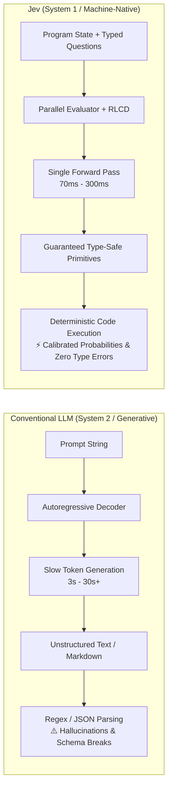

# Jev Fundamentals, Architecture, and Practical Applications

> # ⚠️ SUPERSEDED — DO NOT BUILD FROM THIS DOCUMENT
>
> This document was written **before** its claims were verified against the live TypeSafe
> documentation and independent third-party evaluations. **Ten of its claims did not survive
> that check**, and several would produce a scientifically unsound system if implemented.
>
> **Read [`03_jev_astrophysics_evidence_based_assessment.md`](./03_jev_astrophysics_evidence_based_assessment.md)
> instead** — §1.4 itemizes every correction.
>
> The most consequential errors: calibration is **not** near-zero-ECE out of distribution
> (measured ECE 0.107 against a 0.024 noise floor, refit temperature 2.74); `confidence` is a
> distribution-shape statistic and **not** the probability an answer is correct, so any
> confidence-gated policy here is unsound; and packing multiple items into one state degrades
> ranking badly (Spearman 0.932 → 0.579).
>
> It is kept in this repository because the correction history is part of the record, **not**
> because it is reliable.

---

> **TypeSafe AI System One Model (`jev-1.13.0`) Technical Dossier**  
> *Authoritative analysis of machine-native intelligence, RLCD training, API primitives, ecosystem tooling, and general industry applications.*

---

## 1. Executive Summary & The System One Paradigm Shift

In September 2026, **TypeSafe AI** introduced **Jev** (flagship release `jev-1.13.0`), inaugurating a new class of frontier AI models termed **System One models**. Founded by **Diogo Almeida**—a former OpenAI researcher who co-invented the Reinforcement Learning from Human Feedback (RLHF) methods behind InstructGPT and ChatGPT—TypeSafe AI was established on a radical yet practical premise:

> **Human-to-AI chat represents less than 1% of the future of automation. The remaining 99% will be machine-to-machine and software-to-software execution.**

For four years, the AI industry focused almost exclusively on making autoregressive large language models (LLMs) better at talking to humans. However, forcing an autoregressive string generator to make operational decisions inside software runtimes introduces severe architectural friction:
- High latency ($3\text{s} - 30\text{s}+$ for reasoning models).
- High operational expense ($1 - $30 per million output tokens).
- Non-zero rates of schema breakage, invalid JSON, and hallucinated fields.
- Epistemic overconfidence ("hallucinating with a straight face" due to RLHF human preference bias).

Jev discards open-ended string generation entirely. It takes arbitrary program state (raw text, Markdown, or structured JSON) alongside typed evaluation questions, returning **guaranteed type-safe values accompanied by mathematically calibrated probabilities** in **70ms–500ms** at **$0.042 per million input tokens** with **free output tokens**.



---

## 2. Core Architecture & Operating Principles

### 2.1 The Kahneman Duality & The Jevons Paradox

The name **System One** draws on Daniel Kahneman’s cognitive psychology framework (*Thinking, Fast and Slow*):
- **System 1**: Fast, instinctive, automatic, and parallel snap judgments.
- **System 2**: Slow, deliberative, sequential, and computationally expensive reasoning.

Where frontier LLMs (e.g., o1/o3, GPT-5, Claude 3.5 Sonnet) function as System 2 reasoning engines, Jev is explicitly optimized as a System 1 reflex engine.

The name **Jev** pays homage to William Stanley Jevons and the **Jevons Paradox**: when technological efficiency increases the ease of using a resource, total consumption of that resource increases exponentially. By dropping decision latency from 10 seconds to 100 milliseconds and slashing costs by over 400x, Jev enables software to invoke frontier-grade intelligence hundreds of times per second across tight loops, database queries, and background daemons.

### 2.2 Parallel Sampling vs. Autoregressive Decoding

Traditional LLMs predict tokens autoregressively:
$$P(y_1, y_2, \dots, y_T \mid x) = \prod_{t=1}^T P(y_t \mid y_{<t}, x)$$
Generating 500 tokens of structured JSON requires 500 sequential forward passes over GPU memory, creating a physical latency floor.

Jev introduces a **parallel sampler**:
- The model evaluates the state and computes logits across all defined questions and candidate choices simultaneously in a single forward pass ($O(1)$ decoding step).
- Adding 10 or 20 questions to a single request produces virtually no incremental latency increase, costing only the minor token overhead of the question definitions themselves.

### 2.3 RLCD: Reinforcement Learning for Calibrated Decisions

Conventional post-training methodologies are ill-fitted for deterministic software:
1. **RLHF (Reinforcement Learning from Human Feedback)**: Teaches models to produce responses that human annotators rate favorably. This causes **mode dropping** (collapsing diverse probabilities onto formulaic conversational answers) and **sycophancy** (feigning certainty to please the user).
2. **RLVR (Reinforcement Learning with Verifiable Rewards)**: Optimizes models for formal proofs and coding via extended chain-of-thought tokens, maximizing correctness at the cost of immense latency.
3. **RLCD (Reinforcement Learning for Calibrated Decisions)**: TypeSafe AI's proprietary training method. It optimizes the network to output **epistemically honest, calibrated probabilities** across finite decision spaces:
   - If Jev assigns an event probability $P = 0.80$, that outcome occurs approximately 80% of the time across test distributions.
   - When evidence is contradictory or missing, the probability distribution widens, directly exposing uncertainty to the calling application.

---

## 3. The Three Primitives of Jev

Every Jev API call evaluates a single **State** (text, Markdown, or JSON) against a dictionary of **Questions** formulated via three declarative primitives:

```
                                  ┌── Choice Question ──► {choice, probabilities, confidence}
Program State (Text / JSON) ──► Jev ──┼── Score Question  ──► {score, legend, probabilities, confidence}
                                  └── Noul Question   ──► {noul: float in [0, 1]}
```

### 3.1 `Choice`: Discrete Classification and Routing
- **Purpose**: Selects exactly one option from a declared set of categorical criteria (cardinality supported up to 255 direct options).
- **Returned Data**:
  - `choice`: The winning key string.
  - `probabilities`: Normalized float mapping across every option (sums to 1.0).
  - `confidence`: Derived scalar $[0, 1]$ summarizing the entropy/peakedness of the distribution.

### 3.2 `Score`: Continuous Rubric Evaluation
- **Purpose**: Rates the state along an ordered qualitative spectrum (e.g., from trivial bug to catastrophic outage).
- **Returned Data**:
  - `score`: Continuous floating-point position along the spectrum (the expectation over the rubric levels).
  - `legend`: Mapping of rubric levels.
  - `probabilities`: Distribution across individual rubric steps.
  - `confidence`: Derived scalar $[0, 1]$ reflecting certainty.

### 3.3 `Noul`: Calibrated Boolean Truth Probability
- **Purpose**: Evaluates whether a specific proposition is true given the state.
- **Returned Data**:
  - `noul`: A single float $\in [0, 1]$ representing $P(\text{yes})$.
- **Design Note**: Noul has no separate `confidence` field because the value itself directly encapsulates binary epistemic uncertainty ($0.5$ represents complete ambiguity; $0.0$ and $1.0$ represent complete certainty).

```python
from typesafe_sdk import TypeSafeClient, Choice, Score, Noul

client = TypeSafeClient()

state = {
    "error_log": "Connection refused on postgres-primary:5432 after 3 retries",
    "service": "payments-backend",
    "active_transactions": 412
}

response = client.system_one(
    state=state,
    questions={
        "root_cause": Choice(
            instructions="Identify the primary failure domain for `error_log`",
            criteria={
                "db_down": "Database server unavailable or rejecting connections",
                "network_partition": "VPC routing or firewall failure",
                "app_bug": "Invalid SQL syntax or connection leak"
            }
        ),
        "severity": Score(
            instructions="Rate incident impact severity given `active_transactions`",
            criteria=[
                "Low: background worker affected, zero customer loss",
                "Medium: non-critical checkout latency, degraded UX",
                "Critical: revenue loss, transactions failing, page on-call"
            ]
        ),
        "requires_pagerduty": Noul(
            instructions="Does this incident require immediately paging the primary on-call engineer?"
        )
    }
)

# Output is immediately consumable by surrounding software
root_cause = response.answers["root_cause"].choice        # e.g., 'db_down'
confidence = response.answers["root_cause"].confidence    # e.g., 0.98
impact_score = response.answers["severity"].score         # e.g., 2.15 (between Medium and Critical)
page_now = response.answers["requires_pagerduty"].noul > 0.85
```

---

## 4. Head-to-Head Comparison: Jev vs. Conventional LLMs

| Feature / Dimension | Conventional Frontier LLMs (GPT-4o, Claude 3.5, Gemini 1.5) | TypeSafe System One (Jev 1.13) |
| :--- | :--- | :--- |
| **Output Paradigm** | Free-form strings, Markdown, sequential JSON tokens | **Guaranteed typed primitives** (`Choice`, `Score`, `Noul`) |
| **Decoding Pass** | Sequential token loop ($O(T)$ sequential GPU steps) | **Parallel query evaluation** ($O(1)$ single forward pass) |
| **End-to-End Latency** | 3,000ms – 30,000ms+ | **70ms – 500ms** (40x – 200x faster) |
| **Input Pricing** | $0.20 – $10.00 / MTok | **$0.042 / MTok** ($42 per billion tokens) |
| **Output Pricing** | $1.00 – $30.00 / MTok | **$0.00 (FREE / too cheap to meter)** |
| **Schema Validation Errors**| 1% – 8% failure rate (parsing errors, missing keys) | **0% (Mathematically impossible)** |
| **Confidence Metric** | Uncalibrated, prone to confident hallucinations | **Calibrated probabilities** on all outcomes |
| **Free-Form Text Generation**| Superhuman prose, creative drafting, coding | **None (Cannot generate arbitrary text)** |
| **Arithmetic & Counting** | Performs token-level calculation in chain-of-thought | **Weak (Must be executed in surrounding code)** |

---

## 5. First-Party Jaggedness, Trade-Offs, and Limitations

Based on TypeSafe AI's empirical jaggedness documentation (`jev-1.13`), developers must design around specific constraints:

1. **Text-Only Context Window**: Jev accepts text, Markdown, and JSON. It cannot process raw pixels, PCM audio, or video files. Multi-modal pipelines require upstream OCR or vision models.
2. **Token Budgets**: 64,000 total request tokens; maximum 32,000 tokens for state plus longest question.
3. **Weak Counting and Numerical Arithmetic**: Jev cannot reliably count list items, characters, or occurrences, nor perform arithmetic. Arithmetic belongs in deterministic code:
   - *Wrong*: Asking Jev "How many errors occurred in this log?"
   - *Right*: Iterating entries in Python, querying a Noul for each, and summing in code.
4. **Weak Temporal / Date Reasoning**: Jev does not parse dates chronologically. It cannot calculate elapsed days or check whether a timestamp falls between two dates. (Pattern: extract date components using Choice, execute calendar comparisons in Python's `datetime`).
5. **Context Rot from Irrelevant State**: Bloating state with thousands of irrelevant tokens degrades calibration. Filter state before sending.
6. **No Structural Invariance Guarantee**: Independent questions do not enforce mathematical identities: $P(\text{Noul } A)$ and $P(\text{Noul not-}A)$ do not necessarily sum to 1.0.
7. **Adversarial State Vulnerability**: Text in state attempting prompt injection can skew classification unless criteria explicitly anticipate and counteract adversarial attempts.

---

## 6. Open-Source Ecosystem & Tooling Landscape

The Jev community has rapidly published integrations, SDKs, and open reproductions:

### 6.1 Provider Integrations & Runtimes
- **Cloudflare Workers AI**: Native `typesafe/jev` endpoint accepting state and typed questions.
- **Vercel AI Gateway**: Native support for `typesafe-ai/jev` through the experimental AI SDK `evaluate` interface.
- **OpenRouter**: Hosted provider endpoint for `typesafe/jev-1.13` and `typesafe/jev-latest`.

### 6.2 Data Engineering & Database Tooling
- **`duckdb-jev`**: DuckDB extension exposing Jev evaluations directly inside SQL queries (`SELECT jev_choice(text, ['A', 'B'])`).
- **`pg-jev` / `pg_typesafe`**: PostgreSQL extensions enabling semantic filtering and indexing directly inside relational tables.
- **`jevql`**: A psql-compatible client that filters, sorts, and groups SQL query results based on semantic Jev predicates.
- **`jev-curate`**: Streaming pipeline filtering multi-gigabyte Parquet and JSONL datasets.

### 6.3 Agent Frameworks & Supervision
- **`jev-belay`**: A Claude Code Stop-hook that inspects git diffs and terminal transcripts before allowing an agent to exit, preventing premature completion claims.
- **`jev-scout`**: Model Context Protocol (MCP) server scoring search queries, URLs, and scraped pages for relevance and credibility.
- **`jev-ultrafast` & `Jev for Chrome`**: Sub-200ms browser automation where Jev selects interactive DOM elements from an accessibility tree while a generative LLM writes text inputs.
- **`blink`**: Codebase navigator using Jev-guided tree search over file paths for natural-language queries.

### 6.4 Open-Weight Reproductions & Academic Models
- **`kev`**: Qwen2.5-0.5B adapter and parallel decision head outputting typed choices.
- **`PlayJev`**: Open 0.8B vision-language model reading 448px game frames and outputting discrete actions in a single forward pass.
- **`SemIf` / `Verdict-open-jev`**: Open ModernBERT decision engines reproducing calibrated uncertainty over finite options.
- **`openjev-sglang`**: High-performance prefill-only inference server implementing the System One API.

---

## 7. Practical Use Cases Across 11 Domains

```
┌────────────────────────────────────────────────────────────────────────┐
│                        JEV APPLICATION MATRIX                          │
├──────────────────────────┬──────────────────────────┬──────────────────┤
│ Category                 │ Application Pattern      │ Core Primitive   │
├──────────────────────────┼──────────────────────────┼──────────────────┤
│ 1. Developer Tools       │ Low-Latency Shell History│ Choice           │
│ 2. Software Engineering  │ Pre-Commit & Agent Belay │ Noul + Score     │
│ 3. Automation & Agents   │ Real-Time DOM Selector   │ Choice           │
│ 4. Personal Productivity │ Notification Firewall    │ Choice + Score   │
│ 5. Knowledge Management  │ Entity Deduplication     │ Score            │
│ 6. Data Processing       │ RAG Passage Reranker     │ Score + Noul     │
│ 7. Research & Education  │ Verbatim Citation Check  │ Choice           │
│ 8. Infrastructure/DevOps │ OTel Log Stream Triage   │ Choice + Score   │
│ 9. Business Applications │ Dispute / Refund Arbiter │ Choice + Noul    │
│ 10. Creative Media       │ Video Sponsor Detector   │ Noul             │
│ 11. Experimental / Games │ Sub-100ms Game Loop AI   │ Choice           │
└──────────────────────────┴──────────────────────────┴──────────────────┘
```

### Detailed Breakdown of Core Applications

1. **Developer Tools: Semantic Shell History & Palette (`jev-palette`)**
   - *Problem*: Traditional fuzzy-match (`fzf`) fails when the user describes the intent ("undo last commit keeping files") rather than exact syntax. LLMs take 3 seconds, breaking shell responsiveness.
   - *Jev Implementation*: Evaluates terminal history and current prompt against 100 candidate commands in 80ms using `Choice`.

2. **Software Engineering: Coding Agent Done-Gate (`jev-belay`)**
   - *Problem*: Autonomous coding agents (Claude Code, Devin) frequently hallucinate task completion when unit tests fail or unmentioned changes were made.
   - *Jev Implementation*: A pre-exit hook evaluates git diffs and test logs across four orthogonal Noul questions (`satisfies_spec`, `unmentioned_side_effects`, `debug_leftovers`, `credential_leak`), blocking execution if confidence falls below threshold.

3. **Automation: Real-Time DOM Targeting (`jev-ultrafast`)**
   - *Problem*: Browser agents spend $0.05 and 5 seconds per click analyzing HTML.
   - *Jev Implementation*: Accessibility trees are filtered to interactive elements. Jev evaluates target selection in 150ms via `Choice`, reserving generative LLMs solely for writing email bodies or form text.

4. **Data Processing: High-Speed RAG Passage Reranker (`jev-reranker`)**
   - *Problem*: Cross-encoders are resource-heavy, while LLM rerankers are slow and output uncalibrated scores.
   - *Jev Implementation*: Scores 30 candidate retrieval passages in parallel using `Score` (relevance) and `Noul` (prompt injection check), stripping out 80% of irrelevant context before invoking expensive generation.

5. **Infrastructure: Real-Time OTel Log Triage (`jevlogs`)**
   - *Problem*: Regex log rules break on unseen exceptions; LLMs cannot handle 500 logs/second.
   - *Jev Implementation*: Batched into DuckDB/Postgres pipelines via `duckdb-jev`, classifying root-cause categories and severity in sub-200ms at $42 per billion input tokens.

---

## 8. Prioritized Projects for Immediate Prototyping

| Rank | Project Name | Description | Key Tech Stack | Estimated Time to MVP |
| :---: | :--- | :--- | :--- | :---: |
| **#1** | **`AgentBelay`** | Sub-200ms Stop-Hook & Safety Belay for Coding Agents | Python, GitPython, `typesafe-sdk-python`, Click | **3 days** |
| **#2** | **`ColdStoragePruner`** | Non-Generative Semantic Context Compactor for Agent Histories | TypeScript, Node.js, `typesafe-sdk-js`, LangChain | **4 days** |
| **#3** | **`DuckJev-Analytics`** | SQL UDFs for Semantic Classification in DuckDB over Parquet | DuckDB, Python / PyArrow, `typesafe-sdk-python` | **3 days** |
| **#4** | **`JevLog-Sentinel`** | High-Throughput OTel Log Stream Triage & Alert Router | Go, Vector / OpenTelemetry, TypeSafe REST API | **4 days** |
| **#5** | **`DOM-Reflex`** | Dual-Engine Headless Browser Automation Substrate | Playwright, TypeScript, Chromium A11y Tree | **5 days** |
| **#6** | **`CitationGuard`** | Continuous RAG Citation Entailment & Attribution Checker | Python, FastAPI, `typesafe-sdk-python`, Pydantic | **2 days** |

---

## 9. Conclusion: What Becomes Possible Because of Jev

Jev marks the transition of artificial intelligence from an **expensive advisory chatbot** to an **integrated runtime microprocessor**:

1. **Elimination of JSON Serialization Failures**: Guaranteed type-safety removes entire defensive software layers previously required for schema repairs and parser retries.
2. **The Era of "Smart If-Statements"**: Developers can now embed semantic intelligence directly inside microsecond event loops, database queries, and operating system hooks.
3. **The Biological Dual-Engine Model**: Future AI architectures will pair fast System 1 reflex models (Jev) for 95% of operational routing and validation with slow System 2 generative models for creative synthesis.
