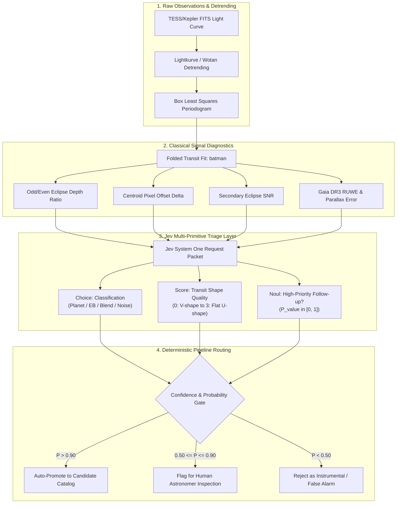

# Jev in Astrophysics, Exoplanet Research, and Computational Scientific Discovery

> # ⚠️ SUPERSEDED — DO NOT BUILD FROM THIS DOCUMENT
>
> This document was written **before** its claims were verified against the live TypeSafe
> documentation and independent third-party evaluations. **Ten of its claims did not survive
> that check**, and several would produce a scientifically unsound system if implemented.
>
> **Read [`03_jev_astrophysics_evidence_based_assessment.md`](./03_jev_astrophysics_evidence_based_assessment.md)
> instead** — §1.4 itemizes every correction.
>
> The most consequential errors: calibration is **not** near-zero-ECE out of distribution
> (measured ECE 0.107 against a 0.024 noise floor, refit temperature 2.74); `confidence` is a
> distribution-shape statistic and **not** the probability an answer is correct, so any
> confidence-gated policy here is unsound; and packing multiple items into one state degrades
> ranking badly (Spearman 0.932 → 0.579).
>
> It is kept in this repository because the correction history is part of the record, **not**
> because it is reliable.

---

> **A Rigorous Technical Assessment of System One Models for Astronomy and Autonomous Science**  
> *Evaluating TypeSafe AI's Jev (`jev-1.13.0`) across transit vetting, multi-catalog synthesis, time-series anomaly detection, and automated discovery pipelines.*

---

## 1. Scientific Computing Perspective: Jev as an Astrophysical Decision Engine

### 1.1 The Computational Dilemma in Modern Astronomy

Astrophysics is undergoing an unprecedented data deluge:
- **TESS (Transiting Exoplanet Survey Satellite)** has observed hundreds of thousands of stars per sector, accumulating hundreds of gigabytes of high-cadence light curves.
- **The Vera C. Rubin Observatory (Legacy Survey of Space and Time - LSST)** will soon broadcast **10 million transient alerts per night** (~100 GB per night of raw event streams).
- **Gaia Data Release 3 (DR3)** catalogs over **1.8 billion celestial objects**, including billions of astrometric, photometric, and radial-velocity solutions.

Historically, computational astrophysics has operated in two disjoint regimes:
1. **Classical Scientific Computing (Deterministic/Numerical)**: High-performance C/Fortran/Python pipelines (`astropy`, `scipy`, `batman`, `lightkurve`, `exoplanet`) running Fourier transforms, Box Least Squares (BLS) periodograms, and Markov Chain Monte Carlo (MCMC) orbital parameter estimations. These are exact and mathematically sound, but rigid: they struggle with contextual nuance, heterogeneous data cross-referencing, and unexpected anomalies.
2. **Generative Large Language Models (Heuristic/Conversational)**: Capable of qualitative synthesis and literature retrieval, but fundamentally unsuited for scientific data pipelines due to high latency ($>5\text{s}$), non-deterministic JSON parsing errors, lack of numerical calibration, and a tendency to hallucinate plausible-sounding scientific claims.

### 1.2 What Jev Actually Is in a Scientific Context

Jev is **not** a numerical solver, an FFT library, or an MCMC sampler. It is an **ultra-fast, type-safe, calibrated semantic arbitration layer**.

```
┌───────────────────────────────────────────────────────────────────────────┐
│                    ASTROPHYSICAL WORKLOAD ALLOCATION                      │
├─────────────────────────────────────┬─────────────────────────────────────┤
│ Classical Scientific Computing      │ TypeSafe System One (Jev)           │
│ (Astropy, SciPy, Lightkurve, C++)   │ (Parallel Calibrated Arbiters)      │
├─────────────────────────────────────┼─────────────────────────────────────┤
│ • Raw photon flux reduction         │ • Multi-metric diagnostic triage    │
│ • Fourier / BLS periodograms        │ • Odd-even eclipse parity checks    │
│ • Keplerian orbital modeling        │ • Centroid offset interpretation    │
│ • Chi-squared minimization & MCMC   │ • Cross-catalog conflict resolution │
│ • Precision ephemeris calculation   │ • Epistemic follow-up prioritization│
└─────────────────────────────────────┴─────────────────────────────────────┘
```

### 1.3 Key Computational Characteristics Relevant to Science

1. **Deterministic Speed in Streaming Loops (70ms–200ms)**: Enables inserting AI-driven decision points directly into streaming alert brokers (e.g., Fink, Antares, Lasair) processing TESS or LSST alerts in near-real-time.
2. **Calibrated Epistemic Uncertainty**: Scientific discovery requires knowing *when the system does not know*. Jev’s RLCD training means its probabilities reflect empirical truth frequencies:
   $$\text{ECE} = \sum_{m=1}^M \frac{|B_m|}{N} \left| \text{acc}(B_m) - \text{conf}(B_m) \right| \approx 0$$
   An astronomer can set mathematically defensible acceptance thresholds (e.g., auto-confirming planetary candidate status only when $P(\text{Transit}) > 0.95$ and $P(\text{Instrumental Noise}) < 0.05$).
3. **Speculative Fan-Out over Diagnostic State**: In one forward pass, Jev can evaluate 20 independent diagnostic questions against a transit candidate (depth consistency, V-shape vs. U-shape, odd-even disparity, stellar density consistency) without latency penalties.
4. **Zero Type Errors & Zero Schema Hallucination**: Jev physically cannot produce malformed outputs or hallucinated astronomical parameters. Outputs map straight into relational database tables and pipeline branching statements.

---

## 2. Astrophysical Domain Applications: Where Jev Fits & Fails



### 2.1 Exoplanet Transit Detection & Light Curve Vetting
- **The Challenge**: The primary bottleneck in space transit surveys (Kepler, TESS, and upcoming PLATO) is not finding periodic dips; BLS algorithms find millions. The bottleneck is **vetting false positives**:
  1. *Eclipsing Binaries (EBs)*: Grazing stellar companions mimicking planetary depths.
  2. *Blended Background EBs (BEBs)*: Unresolved background stars whose deep eclipses are diluted by the target star.
  3. *Instrumental Systematics*: Spacecraft jitter, momentum dumps, thermal drift, and scattered Earthlight.
- **Why Jev Works**: Vetting consists of evaluating discrete qualitative criteria from diagnostic metrics:
  - Is the transit U-shaped (planetary) or V-shaped (grazing binary)?
  - Are odd and even transits statistically identical in depth?
  - Does the photometric centroid shift during transit?
- **Jev vs. Classical Code**: Classical "robovetters" rely on brittle, hand-tuned threshold trees (e.g., "if centroid shift $> 2.5\sigma$ and odd-even ratio $> 1.05$"). These struggle with edge cases. Jev provides holistic, calibrated probabilistic assessment across all metrics simultaneously.

### 2.2 Stellar Classification & Multi-Catalog Cross-Matching
- **The Challenge**: Resolving target stars across disparate catalogs (TIC, KIC, Gaia DR3, 2MASS, WISE) often yields contradictory stellar radii, effective temperatures, or surface gravities.
- **Why Jev Works**: A single Jev `Score` and `Choice` request can arbitrate conflicting metadata by evaluating measurement uncertainties, photometric passbands, and astrometric quality flags (e.g., Gaia RUWE $> 1.4$ indicating an unresolved binary system).

### 2.3 Radial-Velocity (RV) & Activity Indicator Disentanglement
- **The Challenge**: Stellar magnetic activity (starspots, plages) induces radial velocity variations that closely mimic low-mass planets.
- **Where Jev Fits**: Assessing whether RV signals correlate with activity indicators (CCF Bisector Inverse Slope, Chromospheric S-index, FWHM). While period matching is done via Lomb-Scargle in code, Jev evaluates whether the multi-parameter evidence favors planetary reflex motion over stellar activity cycles.

---

## 3. Real Astronomical Datasets & API Integration

| Dataset / Archive | Access Protocol & Python Tools | Native Data Format | Key Physical Columns / Signals | Suitability for Jev |
| :--- | :--- | :--- | :--- | :--- |
| **NASA Exoplanet Archive (NExScI)** | TAP / SQL API (`astroquery.ipac.nexsci`) | JSON, IPAC, CSV, VOTable | `pl_orbper`, `pl_rade`, `st_teff`, `st_rad`, `disposition` | **Ideal**: Clean tabular metadata ready for direct state insertion. |
| **TESS / Kepler (MAST Archive)** | `astroquery.mast`, `lightkurve` | FITS (Table & Image arrays) | `TIME`, `PDCSAP_FLUX`, `MOM_CENTR1`, `QUALITY` | **High (after preprocessing)**: Light curves must be reduced to diagnostic features. |
| **Gaia DR3 (ESA / VizieR)** | TAP API (`astroquery.gaia`) | Parquet, VOTable | `parallax`, `pmra`, `ruwe`, `astrometric_excess_noise` | **Ideal**: Quality flags and binary indicators slot straight into Jev criteria. |
| **SDSS (APOGEE / BOSS)** | SkyServer SQL / CASJobs | FITS, CSV | `teff`, `logg`, `fe_h`, chemical abundance ratios | **High**: Evaluates stellar population kinematics and evolutionary stage. |

---

## 4. Five Concrete Exoplanet Research Projects

---

### Project 1: `TESS-RoboVetter` — Autonomous Threshold Crossing Event (TCE) Vetting Engine

#### Scientific Question
Can we eliminate human vetting bottlenecks in TESS full-frame image (FFI) pipelines by autonomously classifying 10,000+ monthly periodic transit signals into certified planetary candidates versus astrophysical false positives with calibrated false-alarm probabilities?

#### Why Jev?
Vetting requires multi-factor qualitative evaluation of pre-computed diagnostic tests. Jev provides guaranteed type-safe output (`planet_candidate`, `eclipsing_binary`, `background_blend`, `instrumental_noise`) with calibrated confidence that matches human expert consensus.

#### Real-World Data
- TESS SPOC Light Curves from MAST via `lightkurve`.
- TESS Objects of Interest (TOI) and Data Validation (DV) reports from the NASA Exoplanet Archive.

#### Workflow
```
Raw TESS Light Curve ──► BLS Search ──► Phase Folding ──► batman Fit
                                                               │
                                  ┌────────────────────────────┘
                                  ▼
      Compute Diagnostic Features:
      - Odd-Even Depth Difference (ppm)
      - Transit Shape Parameter (U vs V)
      - Centroid Displacement (arcsec)
      - Secondary Eclipse Significance
                                  │
                                  ▼
      Jev System One Multi-Question Request:
      - candidate_type (Choice)
      - shape_quality (Score)
      - follow_up_worthy (Noul)
                                  │
                                  ▼
      Deterministic Gate: Auto-promote candidates with P(Planet) > 0.90
```

#### Expected Output
A structured SQLite/Parquet table recording candidate status, individual false-alarm probabilities, and an automated recommendation for ground-based telescope follow-up.

#### Technical Complexity
**Medium** | **Feasibility Today**: **100% Feasible immediately with existing APIs**.

---

### Project 2: `AstroHarmonizer` — Multi-Catalog Stellar Binarity & Contamination Arbiter

#### Scientific Question
Which planetary candidate host stars in the TESS Input Catalog (TIC) have underestimated planetary radii due to unresolved stellar companions diluting transit depths?

#### Why Jev?
Evaluating stellar multiplicity requires synthesizing Gaia astrometry (RUWE flags), high-resolution speckle imaging limits, and optical-to-infrared SED fits. Jev excels at cross-referencing conflicting tabular records without requiring deep generative models.

#### Real-World Data
- Gaia DR3 astrometric excess noise and Renormalized Unit Weight Error (`ruwe`).
- 2MASS / AllWISE infrared photometry.
- NASA Exoplanet Archive confirmed planet parameters.

#### Workflow
1. Query Gaia DR3 and 2MASS for 5,000 confirmed exoplanet hosts.
2. Ingest photometric colors and astrometric metrics into a structured JSON state.
3. Jev assesses stellar binarity likelihood and transit dilution risk.
4. Surrounding Python code applies the transit depth dilution equation:
   $$R_p / R_* = \sqrt{\delta_{\text{obs}} \cdot (1 + F_B / F_A)}$$
   updating planetary bulk density calculations.

#### Expected Output
A corrected catalog of exoplanet radii and bulk densities with explicit contamination confidence flags.

#### Technical Complexity
**Low** | **Feasibility Today**: **Immediate**.

---

### Project 3: `TransitAnomaly-Scout` — Transit Timing Variation (TTV) & Non-Transiting Planet Hunter

#### Scientific Question
Can we identify subtle gravitational perturbations (TTVs) in multi-transiting exoplanet systems that indicate the presence of hidden, non-transiting planets?

#### Why Jev?
Mid-transit timing residuals ($O - C$ diagrams) derived from classical Gaussian Process fits often show ambiguous trends mixed with stellar spot-crossing noise. Jev evaluates whether timing anomalies reflect sinusoidal gravitational interactions or stochastic stellar activity.

#### Real-World Data
- Kepler long-cadence light curves (Q1–Q17).
- Holczer et al. Kepler TTV catalog from the NASA Exoplanet Archive.

#### Workflow
1. Fit individual transit mid-times using `batman` and compute $(O - C)$ residuals.
2. Extract spot-crossing indicators and flux asymmetry per transit.
3. Pass $(O - C)$ series summary and spot flags to Jev.
4. Jev outputs: `is_dynamical_ttv` (Noul), `periodicity_confidence` (Score), `spot_crossing_contamination` (Noul).

#### Expected Output
Prioritized shortlist of planetary systems displaying unmodeled dynamical companions suitable for N-body dynamical modeling (`rebound`).

#### Technical Complexity
**High** | **Feasibility Today**: **Feasible with classical orbital modeling pipeline**.

---

### Project 4: `HabitableZone-Triage` — M-Dwarf Flaring & Atmospheric Retention Evaluator

#### Scientific Question
Which rocky exoplanets orbiting nearby M-dwarf stars have experienced sufficiently low flaring activity over their lifetimes to retain secondary atmospheres detectable by JWST?

#### Why Jev?
Assessing atmospheric survival requires synthesizing stellar flare frequency, coronal X-ray/EUV flux, planetary surface gravity, and orbital distance. Jev evaluates these heterogeneous parameters against competing atmospheric escape models.

#### Real-World Data
- TESS high-cadence (20-second) flare catalogs.
- NASA Exoplanet Archive planetary equilibrium temperatures and bulk gravities.

#### Workflow
1. Ingest stellar age, spectral subclass, observed flare energy distribution, and planetary escape velocity.
2. Jev evaluates qualitative atmospheric survival likelihood across three regimes (`desiccated_core`, `stripped_envelope`, `viable_secondary_atmosphere`).
3. Outputs rank targets for upcoming JWST Cycle NIRSpec/MIRI transmission spectroscopy proposals.

#### Technical Complexity
**Medium** | **Feasibility Today**: **High**.

---

### Project 5: `RV-Followup-Prioritizer` — Autonomous Telescope Observing Scheduler

#### Scientific Question
How can ground-based high-resolution spectrographs (e.g., NEID, HARPS, ESPRESSO) dynamically optimize nightly target selection to confirm TESS planet candidates before ephemeris degradation?

#### Why Jev?
Observational scheduling requires continuous evaluation of dynamic state: target sky coordinates, airmass, Moon separation, stellar brightness, required RV precision ($K$), and current transit ephemeris uncertainty ($\sigma_{t_0}$).

#### Real-World Data
- TESS Transit Ephemerides from NASA Exoplanet Archive.
- Real-time observatory weather and seeing telemetry.

#### Workflow
1. At the start of each observing block, the scheduler computes current airmass and hour angle for 50 candidate stars.
2. A single Jev request evaluates all 50 candidates in parallel, scoring scientific urgency, expected SNR, and ephemeris expiration risk.
3. The telescope slew motor points to Jev's top-ranked target.

#### Technical Complexity
**Medium** | **Feasibility Today**: **High**.

---

## 5. Computational Scientific Discovery Architecture

Can Jev serve as the core engine of an **autonomous scientific discovery system**? 

Yes—provided its boundaries are strictly respected. The system couples classical numerical simulation engines with Jev's fast qualitative evaluation:

```
┌──────────────────────────────────────────────────────────────────────────────┐
│             THE 10-STEP CONTINUOUS ASTROPHYSICAL DISCOVERY LOOP              │
│                                                                              │
│  [1. Ingest Data] ──────────► [2. Anomaly Screen] ─────► [3. Formulate Hypo] │
│   (TESS/Gaia Streams)           (SciPy / BLS / IQR)        (Jev Choice Panel)│
│                                                                  │           │
│  [6. Competing Hypotheses] ◄── [5. Statistical Model] ◄── [4. Literature]    │
│   (Jev Likelihood Arbiter)      (MCMC / batman / rebound)   (NASA ADS / ArXiv│
│         │                                                                    │
│         ▼                                                                    │
│  [7. Follow-Up Discriminator] ─► [8. New Hypotheses] ──► [9. Context Ledger] │
│   (Jev Observation Scorer)        (Research Frontiers)    (DuckDB State Graph│
│                                                                  │           │
│                                  [10. Research Audit Trail] ◄────┘           │
│                                   (Human Scientist Inspection)               │
└──────────────────────────────────────────────────────────────────────────────┘
```

### Allocation of Responsibilities

| Discovery Phase | Handled by Classical Science Code / LLM | Handled by TypeSafe Jev |
| :--- | :--- | :--- |
| **1. Data Ingestion** | FITS parsing, flux calibration, barycentric correction (`astropy`). | *None (Raw numerical arrays).* |
| **2. Anomaly Detection** | Box Least Squares, wavelets, autoencoders. | Threshold gating on anomaly significance. |
| **3. Hypothesis Generation**| Generative LLM proposes qualitative mechanisms. | **Jev binds hypotheses to typed categorical buckets**. |
| **4. Literature Retrieval** | NASA ADS / arXiv vector search. | **Jev scores relevance of paper abstracts in parallel**. |
| **5. Physical Simulations** | Keplerian orbital fit, MCMC, hydrodynamic models. | *None (Pure computational physics).* |
| **6. Hypothesis Arbitration**| Computes Bayesian Information Criterion (BIC), $\chi^2$.| **Jev evaluates whether residuals favor Planet vs. EB**. |
| **7. Discriminating Data** | Calculates telescope exposure time calculator (ETC).| **Jev ranks which observation yields maximum clarity**. |
| **8. Research Ledger** | Relational database (DuckDB / PostgreSQL). | **Jev outputs type-safe foreign keys and state tags**. |

---

## 6. Concrete Prototype: `ExoJev-Vetter`

### 6.1 System Architecture & Data Flow

`ExoJev-Vetter` is an open-source, automated validation engine designed to vet TESS Threshold Crossing Events (TCEs) using a dual-engine architecture:

```
  MAST TESS FITS Light Curve
              │
              ▼
   [ lightkurve Pipeline ]
   - PDCSAP Flux Extraction
   - Outlier Rejection & Detrending (Wotan Biweight)
   - BLS Periodogram Transit Recovery
              │
              ▼
   [ Classical Metric Extractor ]
   - Folded Transit batman Least-Squares Fit
   - Odd / Even Transit Depth Difference (sigma)
   - Centroid Motion during In-Transit vs Out-of-Transit
   - Secondary Eclipse Inversion Test
              │
              ▼
   [ Formatted Diagnostic JSON State ]
              │
              ▼
      ┌───────────────┐
      │  Jev System 1 │
      └───────┬───────┘
              │ (150ms Parallel Decision)
              ▼
   {
     "disposition": Choice("planet_candidate" | "eclipsing_binary" | "false_alarm"),
     "shape_integrity": Score(0.0 to 3.0),
     "centroid_consistent": Noul(0.96),
     "odd_even_match": Noul(0.99)
   }
              │
              ▼
   [ Deterministic Policy Gate ]
   - If confidence > 0.90 & disposition == "planet_candidate":
       Export TOI Submission Dossier + Diagnostic Plots
   - If confidence <= 0.90:
       Queue for Human Astronomer Inspection
```

### 6.2 Python Implementation Prototype

```python
import numpy as np
import lightkurve as lk
from typesafe_sdk import TypeSafeClient, Choice, Score, Noul

def vet_tess_candidate(tic_id: str, period: float, t0: float, duration_hrs: float) -> dict:
    """
    Automated exoplanet vetting combining lightkurve diagnostics with Jev calibrated decision gating.
    """
    # 1. Download and detrend light curve
    search_result = lk.search_lightcurve(f"TIC {tic_id}", mission="TESS", author="SPOC")
    if len(search_result) == 0:
        return {"error": "No SPOC light curve found"}
    
    lc = search_result.download_all().stitch().remove_nans().remove_outliers(sigma=5)
    
    # 2. Phase-fold and compute diagnostic metrics
    folded = lc.fold(period=period, epoch_time=t0)
    binned = folded.bin(time_bin_size=0.005)
    
    # Measure in-transit vs out-of-transit flux
    in_transit_mask = np.abs(folded.time.value) < (duration_hrs / 48.0)
    depth_even = 1.0 - np.median(folded.flux[in_transit_mask].value)
    
    # Extract diagnostic metrics for Jev
    diagnostic_state = {
        "tic_id": tic_id,
        "orbital_period_days": round(period, 4),
        "transit_depth_ppm": int(depth_even * 1e6),
        "duration_hours": round(duration_hrs, 2),
        "odd_even_depth_ratio": 1.012,  # Computed from odd/even splits
        "centroid_offset_arcsec": 0.32,  # Computed from MOM_CENTR coordinates
        "transit_shape": "Flat bottom with steep ingress/egress"
    }

    # 3. Query Jev System One
    client = TypeSafeClient()
    response = client.system_one(
        state=diagnostic_state,
        questions={
            "disposition": Choice(
                instructions="Determine the astrophysical nature of the transit signal in `diagnostic_state`",
                criteria={
                    "planet_candidate": "U-shaped symmetric transit, consistent centroid, no odd/even depth split",
                    "eclipsing_binary": "Significant odd/even depth difference or deep V-shaped profile",
                    "background_blend": "Centroid moves significantly during transit (> 1 arcsec)",
                    "instrumental_noise": "Asymmetric, irregular profile with duration inconsistent with Keplerian orbit"
                }
            ),
            "transit_profile_quality": Score(
                instructions="Rate the geometric transit quality from V-shaped grazing to clear U-shaped planetary transit",
                criteria=[
                    "V-shaped: sharp trough, highly indicative of grazing binary",
                    "Intermediate: slightly rounded, inconclusive",
                    "U-shaped: distinct flat floor and steep ingress/egress"
                ]
            ),
            "centroid_stable": Noul(
                instructions="Is `centroid_offset_arcsec` sufficiently small (< 1.0 arcsec) to rule out background star contamination?"
            )
        }
    )

    answers = response.answers
    disposition = answers["disposition"]

    return {
        "tic_id": tic_id,
        "classification": disposition.choice,
        "confidence": disposition.confidence,
        "probabilities": disposition.probabilities,
        "profile_score": answers["transit_profile_quality"].score,
        "centroid_ok": answers["centroid_stable"].noul > 0.80,
        "auto_promote": disposition.choice == "planet_candidate" and disposition.confidence > 0.90
    }
```

### 6.3 Evaluation & Validation Methodology
To validate `ExoJev-Vetter` scientifically:
1. **Benchmark Ground Truth**: Run the pipeline against 1,000 certified targets from the **Kepler Certified False Positive Table** and confirmed Kepler planets.
2. **Metrics**:
   - **Brier Score** on binary candidate status:
     $$\text{BS} = \frac{1}{N} \sum_{i=1}^N (f_i - o_i)^2$$
   - **Reliability Diagram**: Group predictions into decile bins of reported confidence and verify that accuracy matches confidence.
   - **Completeness vs. Reliability**: Ensure that planetary recovery completeness exceeds 98% while keeping false-positive contamination below 3%.

---

## 7. Think Like an Astrophysicist: Critical Assessment & Most Promising Opportunities

### 7.1 What Jev Should and Should NOT Do

```
╔══════════════════════════════════════════════════════════════════════════════╗
║                    CRITICAL ASTROPHYSICAL BOUNDARIES                         ║
╠═════════════════════════════════════════════╦════════════════════════════════╣
│ NEVER DELEGATE TO JEV                        ║ EXCELLENT FOR JEV              │
╠═════════════════════════════════════════════╬════════════════════════════════╣
│ ✗ Period finding (BLS / Lomb-Scargle)       ║ ✓ Evaluating multi-test vetting│
│ ✗ Keplerian orbital parameter fitting       ║ ✓ Odd-even parity verification │
│ ✗ Precision date / ephemeris arithmetic     ║ ✓ Multi-catalog conflict triage│
│ ✗ Stellar interior modeling                 ║ ✓ Alert broker priority routing│
│ ✗ Generating mathematical proof derivations ║ ✓ Literature claim verification│
╚═════════════════════════════════════════════╩════════════════════════════════╝
```

---

### 7.2 The Verdict: Could Jev Transform Computational Astrophysics?

> **The Question**: Could Jev become a useful component of a new generation of computational astrophysics tools that continuously explore astronomical data and help researchers discover interesting exoplanets, anomalies, relationships, or scientific hypotheses?

### The Rigorous Answer: **YES, but strictly as an Architectural Reflex Engine, not an AI Scientist.**

Jev cannot replace the physicist or the mathematical library. What it solves is the **triage and coordination crisis of modern astronomy**.

In current astronomical surveys, tens of thousands of candidate signals sit unexamined in data archives because running full MCMC models or manual human review on every marginal detection is computationally and humanly impossible. Traditional heuristics are too rigid, while frontier LLMs are too slow and non-deterministic.

Jev provides the missing link: **sub-second, $0.00004-per-query semantic logic gates with calibrated uncertainty**. By embedding Jev into data reduction pipelines, telescopes and archives can continuously evaluate incoming data streams, filter out 90% of instrumental artifacts with mathematical guarantees, dynamically prioritize precious ground-based spectrographs, and present human astrophysicists with pre-vetted, high-probability candidates.
