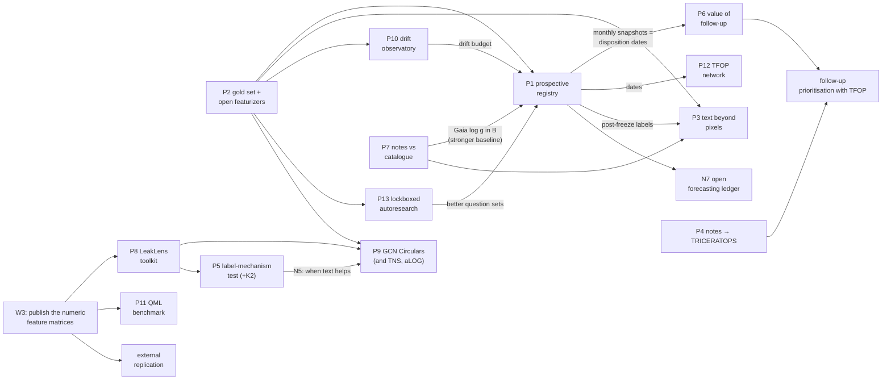

# 06 — The research ecosystem and the roadmap

> This file connects the projects in [`05`](./05_project_proposals.md) into one programme and
> ends with a ten-part roadmap. Nothing here is registered. Every project
> that tests a claim needs its own registration before its first paid call.

---

## 1. How the projects feed each other

**Three chains carry most of the value:**

1. **Validity chain.** P2 (gold + open featurizers) → P1 (prospective, vendor-independent) → P6
   (which observation to take next) → a prioritisation tool TFOP could actually use.
   *Dataset → validated instrument → prospective evidence → decision support.*
2. **Mechanism chain.** E6/E7/E9 → P5 (label mechanism, with K2) → the N5 rule → P9 (tested
   again on GCN Circulars) → a general statement about when expert text adds information.
   *Anomaly → hypothesis → registered test → cross-domain replication.*
3. **Tooling chain.** W3 (publish the matrix) → P8 (LeakLens) → used by P5, P9 and P13 → a
   JOSS paper, plus other fields adopting the dilution floor and volume control.
   *Artifact → library → adoption.*

**Two side branches, deliberately small:** P7 (a quick astrophysics result that also
strengthens every baseline) and P11 (a quantum benchmark, stopped after one round whatever the
result).

---

## 2. Phases

| phase | when | work | spend |
| :--- | :--- | :--- | :--- |
| **0 · housekeeping** | weeks 0–2 | Fix the README's bag-of-words sentence (W1). Add W2 to `RESULTS.md` §10. Note the missing K10-style clause (A4). Label the "4.4×" figures (W13). Ask ExoFOP about publishing derived numbers, and send the leakage finding (`HANDOFF_PROMPT.md` item 4). Draft the RNAAS note | $0 |
| **1 · foundations** | months 1–3 | **P1 registration and T₀ freeze** (the clock starts at freeze). P2 annotation. P7. The P8 skeleton. P10 wired into the monthly CI | ~$2 |
| **2 · core tests** | months 3–9 | P3, P5 (K2 corpus), P13. P1's first checkpoint (T₀+6) | ~$5 |
| **3 · consequences** | months 9–24 | P6 (needs P1's dates), P9, P4, P12. P1's later checkpoints. A synthesis paper | ~$5 |
| **4 · programme** | months 24–36 | Transfer to other expert-text corpora. The open forecasting ledger (N7). A TFOP collaboration on prioritisation | — |

### Decision points (kill criteria, fixed now)

- **P2:** if open featurizers match Jev (within the P2 MDE), make a pinned open model the primary
  featurizer for every later study. Reproducibility then stops depending on a vendor.
- **P1 first checkpoint:** if prospective D − B ≤ 0 with adequate n, **stop the TESS
  "text predicts disposition" line**. Write up the null, and move the effort to the science
  uses (P6, P7) and the methods (P8, P9).
- **W5 arm:** if ExoFOP's structured tables absorb the gain, **withdraw the archive-design
  implication** and restate it as *"the structured follow-up tables are underused"*.
- **P5:** if H5 fails, drop N5 as the organising hypothesis. P9 then stands alone.
- **P11:** one registered round, then stop, whatever the result.

---

## 3. The roadmap

### 1. Current project assessment

A small, unusually disciplined study with **one robust result, one negative replication, and
two portable leakage findings.** The TESS headline (C1) is sturdier than claimed: it survives a
stronger baseline (+0.0354), removing pre-known planets (+0.0342), and a residual name channel
(+0.0383) (E3–E5). The *interpretation* is looser than claimed:

- bag-of-words on top of the catalogue reaches 62–80% of the gain (E2), so "structure beats
  words" is only a +0.009 to +0.017 increment;
- "beyond volume" rests on three recon-spectroscopy features (E6);
- "anticipates consensus" has not been tested prospectively;
- "never reaches the structured catalogue" was never tested against ExoFOP's own structured
  tables.

The Kepler negative is real, and it has a candidate mechanism (E7, E9).
Full detail: [`01`](./01_critical_assessment.md) and [`02`](./02_exploratory_checks.md).

### 2. Critical weaknesses and unanswered questions

- **High:** W1 (single-modality bag-of-words comparison), W2 (question topics chosen with
  outcome information), W3 (one proprietary, drifting featurizer), W4 (no gold labels), W11 (no
  external replication).
- **Medium:** W5 (the baseline covers only the TOI table), W6 ("beyond volume" is narrow), W7
  (survivorship in S2), W8 (intervals ignore fitting variance), W10 (utility unmeasured), W12
  (TFOPWG notes excluded wholesale), W14 (observation mixed with decision questions).
- **Unasked until now:** whether the text works on *open* candidates; what one observation is
  worth; whether the text is correcting the catalogue; whether the text adds to a pixel vetter;
  and why Kepler differs ([`01`](./01_critical_assessment.md) §7).

### 3. New research directions

Prospective validation. Featurizer-independent replication. Mechanism (the label-generating
process, catalogue correction). Decision value of follow-up. Transfer of the design to other
expert-text corpora. Methods: the dilution floor, lockboxed feature discovery, drift
observatories. Fifty research questions in [`04`](./04_research_questions.md).

### 4. Interdisciplinary opportunities

**Strong:** transient astronomy (GCN, TNS), clinical NLP (the design is already standard
there), statistics (`vimp`, nested CV, PPI and DSL, survival models), and ML
(LLM-as-featurizer benchmarks).
**Moderate:** gravitational-wave and accelerator **logbooks** (operations, not physics),
stellar astrophysics (catalogue correction), science of science (the TFOP network), and
information theory (bits beyond the catalogue).
**Weak, stated as weak:** cosmology and dark sectors (methodology only), black holes (only
through transient text), HPC, and quantum computing.
**None:** quantum many-body physics.

### 5. Most promising project concepts

1. **P1** — prospective registry. The single most important missing test.
2. **P2** — gold set + featurizer-agnostic replication. It unlocks everything else.
3. **P5** — the label-mechanism test with K2. The best scientific story.
4. **P3** — text beyond pixels. `PLAN.md`'s long-term question, now cheap.
5. **P7** — notes vs catalogue. The fastest real astrophysics result.
6. **P9** — the design on GCN Circulars. The best interdisciplinary test.

### 6. Potential quantum-mechanics projects

**None with scientific value was found, and none is forced.** Defensible options, labelled:

- **P11:** a registered QML benchmark on the ExoNotes matrix. **Established, negative result
  expected** (Bowles et al. 2024). Portfolio value only.
- **RQ45:** apply the noisy-instrument toolkit (repeat arms, perturbation arms, noise
  propagation to a headline, mutation-tested verifiers) to run-to-run drift of cloud quantum
  processors. **Incremental.** QCVV is a mature field, and this is only a transfer of
  discipline.
- **RQ46:** a claims ledger for quantum-advantage papers. **Speculative**, with a small n.

### 7. Potential astrophysics projects

P1 (prospective TOI predictions), P3 (text on top of ExoMiner++), P4 (follow-up constraints into
TRICERATOPS), P5 (label mechanism across TESS, Kepler and K2), P6 (value of follow-up
information), P7 (stellar-parameter contradictions, Gaia-adjudicated), P9 (GRB redshift
acquisition from GCN text). Also RQ16 (reliability weights for occurrence rates, speculative),
RQ18 (a text-mined companion catalogue against Gaia), RQ21 (a mislabel audit list, $0), and N1
(the `Comments` field recycled as a free FP-subtype label source).

### 8. Potential AI/ML projects

P2 (a gold benchmark and open featurizers), P13 (lockboxed autoresearch with a label-permuted
control), P10 (a drift observatory), P8 (LeakLens). Also RQ26 (does paraphrase stability predict
validity?), RQ27 (averaging repeated calls as denoising), RQ28 (featurizer disagreement as
uncertainty), RQ30 (distillation to an offline model), and N10 (ExoFOP as a hard extraction
benchmark).

### 9. Potential cross-disciplinary projects

P9 and its siblings (TNS, LIGO aLOG, accelerator eLogs, Zooniverse Talk), P5 plus P9 testing the
**N5 rule** across sciences, P12 (science of science), RQ33 (information-theoretic units for
"text adds signal"), RQ34 (the dilution floor as a general diagnostic), and the pre-registration
metascience note (RQ50).

### 10. Long-term research roadmap

**Year 1: make the claim unassailable or kill it.** Phase 0 corrections, P1 frozen and
registered, P2 gold set and open-featurizer replication, P7, P8 skeleton, P10 running. Output:
an RNAAS note on leakage and pre-registration, and a P2 dataset paper.

**Year 2: explain it and use it.** P5 with K2, P3, P13, and P1's checkpoints. Then P6 on P1's
disposition dates. Output: the label-mechanism paper, the prospective-result paper, and a TFOP
prioritisation prototype (P6 + P4).

**Year 3: generalise it.** P9 on GCN Circulars, and one of TNS, aLOG or eLogs with a partner.
LeakLens adopted beyond this repository. The open forecasting ledger (N7) if P1 shows value.
Output: a cross-domain paper on **when expert text adds information beyond structured data**.
That is the programme-level contribution, and it outlives any one featurizer or archive.

**Throughout:** every test is registered before it runs, every correction is appended rather
than edited, and each project states in advance what result would stop it.

**If only three things happen:**

1. Correct the bag-of-words sentence (W1) and list the topic-selection limitation (W2). This
   costs nothing and protects the credibility the project has earned.
2. Freeze and register P1 now. Every month without a frozen T₀ is a month of prospective
   evidence that can never be collected.
3. Build P2's gold set. It is the one asset that every other direction needs.
